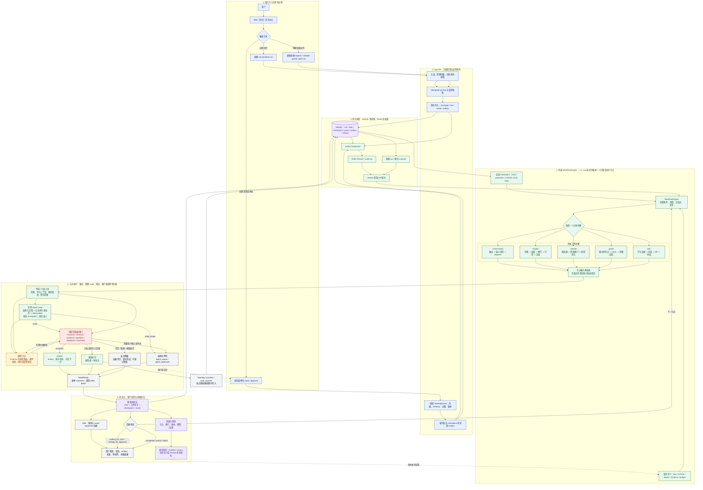

# 408 学习 Agent 工作流编排技术设计

> 版本：v1.1
> 日期：2026-07-21
> 状态：目标设计，作为 Agent Runtime 的实施子基线
> 上游产品契约：[408 学习 Agent 主体 PRD](../product/408-agent-main-prd.md)
> 运行时基线：[408 学习 Agent 对话运行时技术设计](./408-agent-conversation-runtime-design.md)
> 技术选型与风险分析：[Agent 工作流技术选型与风险分析](./408-agent-workflow-technology-selection-and-risk-analysis.md)
> 评测输入：[408 学习 Agent 用户旅程与评测脚本](../product/408-agent-journeys-and-evaluation.md)

## 1. 目的和边界

本设计不是纯 Workflow，也不是让模型以自由 Loop 决定整个业务轨迹。一次学习任务由**外层持久化 Workflow**拆成可验证、可恢复、可观测的业务阶段；在证据探索、查询改写和候选检查等低风险阶段，Workflow 可进入一个**内层有界 Agent Loop**。Loop 依据新 observation 选择下一次白名单内的只读动作，但不能改变业务阶段、权限、审批、写入或预算。它直接决定 Agent 是否会在正确时机澄清问题、检索可靠证据、选择合格练习、避免答案泄露、保留已完成结果，以及把长期学习写入留在用户确认之后。

本文定义 Agent Runtime 中的工作流图、节点契约、分支规则、状态、质量闸门、模型职责和发布方法。它是以下内容的唯一事实源：

- 顶层任务路由，以及 `conversation`、`explain`、`validate`、`grade`、`plan` 的目标工作流。
- 节点类型、输入输出 Schema、持久化状态、合法转移、等待用户输入和审批恢复语义。
- 模型可以在 Loop 中提出的探索决策，和必须由确定性代码作出的决策。
- 证据、题目、批改、计划四类质量闸门及其降级路径。
- 节点预算、并发、重试、局部恢复、版本锁定、回放和工作流评测。

本文不定义线程、SSE、Worker 租约、数据库表全量字段、资源授权或 API 的通用语义，均以[对话运行时技术设计](./408-agent-conversation-runtime-design.md)为准；也不替代 PRD 中的用户流程、学习规则和页面体验约束。本文的 `WorkflowEngine` 是框架无关的业务边界，不预设必须自研或必须引入某个图/持久执行框架；技术实现取舍以[工作流技术选型与风险分析](./408-agent-workflow-technology-selection-and-risk-analysis.md)的 PoC 和 ADR 为准。

### 1.1 当前实现与目标差异

当前 `backend/app/modules/chat` 只有同步 `POST /api/v1/chat` 链路：服务读取 Redis/MySQL 会话，执行 RAG 后直接返回文本和引用。它没有持久工作流状态、节点契约、结构化等待、质量闸门、领域命令幂等或局部恢复。

本文所述 `agent/workflows` 是目标模块，尚未落地。实施必须先建设 Runtime 骨架、此处定义的框架无关工作流契约与相应的执行适配层，再将当前 Chat 的检索调用封装为只读工具；不得在旧同步接口中逐步堆叠工作流分支。

### 1.2 技术实现全景图



### 1.3 如何阅读这张图

1. 从左上开始：用户只能发送消息、点击明确动作，或回答已有的结构化等待；不能把下一节点、工具、资源权限或审批结果作为客户端参数指定。
2. API 先完成认证、资源/状态校验和幂等写入；`run`、首个事件和 outbox 在同一 MySQL 事务中提交，Redis 故障不影响事实落库。
3. Worker 从 MySQL 获取租约后，`WorkflowEngine` 用 run 锁定的定义、版本、摘要和 checkpoint 恢复执行。它一次只推进一个节点，每一步均可持久化、重试或接管。
4. 图中央是效果和安全的核心：外层图先决定当前业务阶段；进入 `agent_loop` 后，模型可用结构化 decision 在白名单内选择下一次只读探索动作，并在每轮提交 observation。Loop 只能以定义好的 `finish`、`need_scope`、`budget_exhausted` 等出口回到外层图。代码/工具读到的是事实，模型只产生结构化提议，质量闸门决定接受、有限修复、等待、降级或阻断；模型不直接决定副作用。
5. 只有通过约束和审批的写入意图才会走领域命令，并以幂等键提交给 `learning`、`practice` 或 `user_sources`。讲解和练习等可见结果先成为 artifact，再随持久事件通过 SSE 回传。
6. 每个 run 的节点轨迹、闸门结果、版本和预算都进入评测闭环。固定回归、shadow 和 canary 用来判断工作流或 Prompt 是否能发布，而不是只比较最终文案是否流畅。

**图例：**蓝色是用户/API 边界，绿色是确定性 Runtime、工作流和领域能力，黄色是受 Schema 限制的模型提议，红色是确定性质量闸门，紫色是持久化与评测事实，灰色是用户可见状态或降级结果。虚线表示恢复或版本反馈，而非一次 run 内的同步调用。

## 2. 设计目标和不可违反的原则

### 2.1 目标

1. **教学有效。** 输出不是泛泛对话，而是围绕当前学习目标、已有证据、错误模式和下一步验证组织。
2. **行为可控。** 工作流图、工具集合、分支次数和副作用边界在代码中固定；模型不能把一次问题扩展为无限制任务链。
3. **事实可追溯。** 每个核心结论、题目、评分点、计划差异都能回到当前用户可见的证据、规则或用户提交内容。
4. **失败不丢成果。** 已创建讲解、练习草稿或确定性判定保留；恢复只重试未知或失败节点。
5. **持续可优化。** 任一模型、Prompt、工具、工作流或数据版本变化，均可在固定轨迹和在线指标上比较效果。

### 2.2 编排原则

1. **外层受限图承载内层有界 Loop。** 每个工作流是代码注册的有向图，边只允许枚举结果；仅 `agent_loop` 节点可在已注册 action/tool 白名单中进行有限回合的“决策 -> 动作 -> observation”。禁止模型返回任意业务节点名、任意 JSON Patch、任意 DAG、任意工具或通用“继续思考”。
2. **一节点一职责。** 一个节点只完成一个可观察目标，例如“检索证据”“生成教学提纲”“校验引用”；不得把检索、生成、写入和最终渲染混入一个模型调用。
3. **事实、提议、展示分离。** 领域读取返回事实；模型返回提议；质量闸门接受或拒绝提议；artifact 和消息只展示已经通过闸门的内容。
4. **先校验，后生成。** 无可靠证据、缺少题目快照、没有评分依据或计划前置数据时，先澄清或诚实降级，不用模型措辞掩盖信息缺失。
5. **一次只问一个必要问题。** 澄清节点只询问阻塞后续路径的最小信息，并携带选择项或结构化输入；最多两轮，仍无法定位时结束为可继续的低风险结果。
6. **副作用只能由领域命令提交。** 工作流节点不直接写学习、练习、计划或资料表；带副作用的节点必须通过 `CommandContext`、幂等键和事务。
7. **预算是工作流和 Loop policy 的一部分。** 每个图固定最大模型调用数、检索轮数、工具调用数、总时长和输出大小；每个 Loop 另固定最大 turn、模型调用、工具调用和时长。超过任一预算必须退出 Loop，进入定义好的闸门或降级节点，而不是继续循环。
8. **失败默认收敛。** 不可判定、解析失败、证据冲突和资源过期默认阻断高风险动作，并返回安全摘要或要求用户重新选择。

### 2.3 禁止模式

- 一个“万能 Agent”通过工具描述自行规划、反省、循环和写入。
- 把一次完整 Loop 包成不可中断的大模型调用，导致工具 observation、预算和恢复不可审计。
- 将模型的 `confidence` 当作权限、事实正确性或审批依据。
- 为了完成工作流而用低相关检索、未审核题目或无来源文字填充空缺。
- 让生成题、主观评分和同一上下文中的自我校验形成单点失败链。
- 把用户自由文本、模型中间推理或完整检索原文作为可变状态无限追加。
- 通过重跑整个 run 修复单个模型调用失败，导致重复创建练习、复习任务或计划变更。

## 3. 术语、范围和职责

| 术语 | 定义 |
|------|------|
| 工作流定义 | 已发布的 `workflow_key@version` 图，包含节点、边、节点参数、预算、Schema 和允许工具。 |
| 节点 | 外层工作流中一次可持久化执行单元，对应一条或多条 `agent_steps` 尝试记录。 |
| `agent_loop` | 一种外层节点类型。在固定业务阶段内运行有界的“结构化决策 -> 白名单动作 -> observation”回合；它不能跳转到任意外层节点。 |
| Loop policy | 随工作流版本锁定的策略对象，声明可用 action/tool、参数 Schema、最大回合/预算、允许出口和是否允许写入或等待。 |
| Loop turn | `agent_loop` 中的一轮决策、动作和 observation；对应一条持久化 `agent_loop_turns` 记录，不等于同一动作的失败重试。 |
| ReAct | Loop 可采用的一种决策协议：模型基于已持久 observation 产出结构化 action，执行器完成动作后把 observation 交回下一轮。它不是可绕过 Workflow 的独立业务引擎。 |
| 事实 | 由领域模块、用户提交或已通过校验的工具返回的不可变数据引用。 |
| 提议 | 模型或排序器输出的候选教学结构、候选题顺序、反馈或计划差异，尚未产生领域影响。 |
| 质量闸门 | 不依赖模型自由判断的规则、资源校验或独立验证，用于接受、修复、降级或阻断提议。 |
| 结构化等待 | `agent_inputs` 或 `agent_approvals` 中持久化的待用户动作；等待期间 Worker 不占有租约。 |
| 轨迹 | 一个 run 实际经过的节点、输入摘要、输出摘要、闸门结果、工具版本和分支集合。 |

### 3.1 首发范围

| 工作流 | 入口 | 目标 | 可产生的领域影响 |
|------|------|------|------|
| `conversation@v1` | 用户自然语言输入 | 路由、最小澄清并调度已注册子工作流 | 无。 |
| `explain@v1` | 自由提问、知识点/题目入口 | 交付带证据的结构化讲解、提示或诚实降级 | 讲解 artifact 和助手消息。 |
| `validate@v1` | 用户点击“用题验证”或明确请求 | 选择合格题目并创建可作答练习快照 | 可撤销练习草稿/会话。 |
| `grade@v1` | 用户提交作答后需要反馈 | 基于固定快照给出评分点、错因候选和下一步 | 反馈 artifact 与待确认错因候选；不自动确认。 |
| `plan@v1` | 初次诊断或明确调整请求 | 生成有依据的计划差异并等待审批 | 只有审批后的计划领域命令可写入。 |

`review`、`report`、`source_ingest` 在后续版本沿用本设计的节点与门禁，不在首发路由中以自由工具形式开放。

### 3.2 顶层工作流选择

`workflow_key` 是 run 创建时锁定的顶层图，运行期间不可替换：

- 用户点击明确操作（“用题验证”“提交答案”“调整计划”）时，API 经过资源和状态校验后直接创建对应顶层 run。
- 纯自然语言消息创建 `conversation@v1`。它只在自身允许的 `dispatch` 节点挂载一个已发布的子工作流，并把 `selected_workflow_key`、版本和输入摘要写入 checkpoint。该调度不是修改 `agent_runs.workflow_key`。
- 已处于 `waiting_for_user` 的 run 回复必须提交到该 run 的结构化输入接口，而不是创建新的 `conversation` run。客户端只有在不存在待答输入时才允许作为新消息发送。

这样一次自然语言会话的路由过程可回放，而直接由页面动作启动的高确定性任务不必额外经过分类模型。

## 4. 编排架构

### 4.1 总体结构

```text
API command
  -> create run with locked workflow definition
  -> Agent Worker acquires lease
  -> WorkflowEngine loads checkpoint + graph
  -> node input builder reads facts and prior approved outputs
  -> node executor (code / tool / model / agent_loop / gate / wait / command)
  -> validate output and decide allowed edge in code
  -> atomically persist step + checkpoint + event
  -> next node, wait, completed, or failed
```

本文所称 `WorkflowEngine` 是框架无关的业务编排边界。当前初步倾向为：P0 首发以 MySQL outbox/lease/Worker 构建最小 durable kernel，LangGraph 做图编排适配层 PoC，Temporal 在 timer/跨服务/SLO 触发后评估。模型调用留在 `model_runtime/`，采用 Pydantic AI 作为 Loop 层的类型安全决策协议实现（工具注册、结构化输出、多提供商切换），不承载 Workflow 持久化。TypeScript Agent SDK（如 `pi-agent-core`）因语言栈错位被排除。候选技术的适用条件、评分和 PoC 验收见[工作流技术选型与风险分析](./408-agent-workflow-technology-selection-and-risk-analysis.md)。

建议目标目录：

```text
backend/app/modules/agent/workflows/
  contracts.py          # WorkflowDefinition, NodeDefinition, NodeResult, state schemas
  registry.py           # published definitions and definition digest lookup
  engine.py             # execute/resume one node at a time
  state.py              # checkpoint serialization, migrations, state readers
  common.py             # context, budget, safe completion and wait helpers
  loops.py              # AgentLoopPolicy, decision validation and per-turn executor
  routing.py            # conversation@v1
  explain.py            # explain@v1 nodes and graph
  validate.py           # validate@v1 nodes and graph
  grade.py              # grade@v1 nodes and graph
  plan.py               # plan@v1 nodes and graph
  gates.py              # reusable deterministic gate implementations
  prompts/              # versioned input builders and response schemas
  tests/
```

### 4.2 已发布定义与版本锁定

每个定义在代码中显式声明，并在部署产物中计算摘要。运行创建时保存 `workflow_key`、`workflow_version`、`workflow_definition_digest`、`state_schema_version`、Prompt bundle 和工具版本。已开始的 run 永远按原定义恢复；新版本只能接收新 run。

```python
@dataclass(frozen=True)
class WorkflowDefinition:
    key: str
    version: str
    state_model: type[BaseModel]
    entry_node: str
    nodes: Mapping[str, NodeDefinition]
    terminal_nodes: frozenset[str]
    budget: WorkflowBudget

@dataclass(frozen=True)
class NodeDefinition:
    key: str
    kind: Literal[
        "code", "model", "tool", "agent_loop", "gate", "wait", "command", "render"
    ]
    input_model: type[BaseModel]
    output_model: type[BaseModel]
    allowed_outcomes: Mapping[str, str]
    retry_policy: RetryPolicy
    timeout_seconds: int
    allowed_tools: frozenset[str]
    loop_policy: AgentLoopPolicy | None
    execute: NodeExecutor
```

`agent_loop` 必须持有一个不可变的 `AgentLoopPolicy`。推荐把策略与工作流定义一起注册、摘要和发布，而不是散落在 Prompt 中：

```python
@dataclass(frozen=True)
class AgentLoopPolicy:
    key: str
    state_model: type[BaseModel]
    decision_model: type[BaseModel]
    allowed_actions: frozenset[str]
    allowed_tools: frozenset[str]
    max_turns: int
    max_model_calls: int
    max_tool_calls: int
    max_elapsed_seconds: int
    exit_outcomes: frozenset[str]
    allow_domain_command: bool = False
    allow_user_wait: bool = False
```

对证据探索的 decision Schema 不是“模型返回任意下一节点名”，而是类似下列受限枚举；执行器还会校验 action 参数只指向当前已授权的范围和候选集合：

```python
class EvidenceLoopDecision(BaseModel):
    action: Literal[
        "retrieve_platform",
        "retrieve_authorized_user_source",
        "inspect_candidate",
        "finish",
        "need_scope",
    ]
    args: dict[str, JsonValue]
    expected_outcome: Literal["continue", "finish", "need_scope"]
```

注册器启动时必须拒绝以下定义错误：入口或边指向不存在节点、不可达节点、没有受限退出条件的非终态闭环、`agent_loop` 缺少 policy 或 policy 允许未注册 action/tool、模型节点允许未注册工具、边缺少输出 Schema、预算为空、节点 key 重复、跨版本引用可变 Prompt 或工具别名。图可以有受限回边，但每个回边必须由持久化计数器和最大次数约束；Loop 只能通过 policy 声明的出口回到外层图。

发布状态为 `draft -> shadow -> canary -> active -> deprecated`。`shadow` 只记录轨迹和评测结果，不影响用户；`canary` 由稳定哈希按用户分桶，不可在一次 run 内切换版本；`deprecated` 只阻止新建，不阻止旧 run 恢复。

### 4.3 节点类型与统一结果

| 类型 | 作用 | 能否调用模型/工具 | 能否写领域事实 |
|------|------|------------------|----------------|
| `code` | 规范化输入、读取事实、选择确定性分支 | 否 | 否。 |
| `model` | 在受限上下文中产生结构化提议或教学内容 | 仅模型适配层 | 否。 |
| `tool` | 只读检索、受控服务读取、低风险 artifact 操作 | 仅节点白名单工具 | 仅工具自身声明且经 policy gate 的低风险操作。 |
| `agent_loop` | 在一个外层业务阶段内，按 policy 重复执行结构化决策、白名单只读动作和 observation | 仅 policy 中的 decision model 与 action/tool | P0 否；不得创建等待或调用领域命令。 |
| `gate` | 校验资源、证据、Schema、质量或权限 | 否 | 否。 |
| `wait` | 创建结构化用户输入或审批并释放 run | 否 | 仅创建等待记录。 |
| `command` | 调用领域命令提交已批准动作 | 不直接调用模型 | 是，必须幂等。 |
| `render` | 由通过闸门的事实和提议生成可见 artifact/消息 | 可用模板或受限模型输出 | 只写 workspace artifact/消息。 |

所有节点返回统一的 `NodeResult`。`outcome` 是定义中枚举的业务结果，而不是任意节点名；Engine 依据 `allowed_outcomes` 取得后继节点。

```python
class NodeResult(BaseModel):
    outcome: str
    facts_patch: dict[str, JsonValue] = {}
    proposal_patch: dict[str, JsonValue] = {}
    artifact_refs: list[ArtifactRef] = []
    warnings: list[SafeWarning] = []
    wait: WaitRequest | None = None
    safe_summary: str | None = None
```

Engine 在持久化前校验：输出符合节点 `output_model`、补丁只可写声明的 state namespace、`outcome` 属于节点允许集合、artifact/领域引用属于当前用户、预算未超限、命令结果和 checkpoint 一致。任一校验失败记为节点失败，不执行后续边。

### 4.4 持久化状态模型

检查点只保存工作流继续执行所需的受控引用与小型结构化数据，不保存完整 Prompt、原始大文件、隐藏推理或无界历史。推荐分为四个命名空间：

```json
{
  "schema_version": "v1",
  "flow": {
    "current_node": "generate_explanation",
    "selected_workflow_key": "explain",
    "selected_workflow_version": "v1",
    "selected_workflow_definition_digest": "sha256:...",
    "loop_counts": {"clarify": 1, "citation_repair": 0},
    "agent_loops": {
      "evidence_exploration": {
        "status": "running",
        "turn_count": 1,
        "model_calls": 1,
        "tool_calls": 1,
        "last_turn_id": "loop_turn_...",
        "seen_candidate_refs": ["cite_..."],
        "exit_outcome": null
      }
    },
    "budget_used": {"model_calls": 2, "tool_calls": 3, "elapsed_ms": 8420}
  },
  "facts": {
    "request": {"message_id": "msg_...", "explicit_mode": null},
    "scope": {"knowledge_point_ids": ["kp_..."], "question_id": null},
    "learning_context_ref": "ctx_...",
    "evidence_set_ref": "evi_...",
    "practice_snapshot_ref": null
  },
  "proposals": {
    "route": {"kind": "explain", "reason_code": "knowledge_question"},
    "teaching_plan_ref": "proposal_...",
    "answer_ref": null
  },
  "controls": {
    "pending_input_id": null,
    "pending_approval_id": null,
    "side_effect_keys": {"practice_draft": "cmd_..."}
  }
}
```

- `facts` 只能由代码、工具成功结果、用户输入或领域命令写入；模型节点不能直接写事实。
- `proposals` 只能由模型、排序器或草稿生成节点写入；只有闸门通过后才能被 `render` 或 `command` 消费。
- `controls` 保存等待对象、幂等键和不可重复副作用引用，恢复时优先查询这些引用。
- `flow.loop_counts` 是外层图回边的唯一计数来源。引擎在进入回边前原子递增；超过上限直接走降级边。
- `flow.agent_loops` 只保存每个 active Loop 的最小恢复状态和已见引用，详细每轮审计保存在 `agent_loop_turns`。Loop 不能把完整检索正文、模型隐藏推理或任意 observation 追加进 checkpoint。

需要保存较大 payload 时，写入受控 `payload_ref` 并在 state 中只保存其 ID、摘要、版本和内容哈希。Schema 演进只能提供显式的 `state vN -> vN+1` 迁移函数；没有迁移函数的旧 run 进入 `failed` 并显示可重试说明，不能猜测字段含义。

### 4.5 单节点执行和恢复

1. Worker 读取当前 checkpoint，并用 run 锁定的定义摘要获取图；摘要不存在或不匹配时停止为 `WORKFLOW_DEFINITION_UNAVAILABLE`。
2. Engine 为当前节点构造仅含允许事实和已批准提议的输入，执行前运行节点前置条件、资源授权和预算检查。
3. 写入 `step.started` 后执行节点。模型或外部工具调用不持有数据库事务。
4. 成功时短事务写 `agent_steps` 输出、必要工具审计、状态补丁、新检查点和 `step.completed` 事件；再由图的合法边确定后继节点。
5. `wait` 节点在同一事务创建 `agent_inputs` 或 `agent_approvals`、保存恢复节点、写 `run.waiting`，然后释放租约。
6. 用户提交输入或审批后，API 先验证对象归属、输入 Schema、版本、过期和幂等键，再更新等待记录、写 checkpoint、投递 outbox。恢复从图中定义的后继节点开始，绝不从用户提交的文本解析节点名。

一个节点 attempt 的状态为 `pending`、`running`、`succeeded`、`failed`、`cancelled` 或 `skipped`。`skipped` 只允许条件分支明确记录，例如客观题无需主观反馈；不得用 `skipped` 掩盖工具失败。模型与只读工具最多创建新 attempt；领域命令恢复时先以幂等键查询结果。

### 4.6 `agent_loop` 的逐轮执行、恢复与安全出口

外层 `agent_steps` 仍表示一个完整的业务阶段，例如 `evidence_exploration_loop`。该 step 处于 `running` 时，Worker 一次只提交一个 Loop turn；提交后可以立即领取下一 turn，也可以由其他 Worker 在租约接管后继续。这样 Loop 不会变成一个不可中断的大调用，同时外层图在 Loop 结束前不会进入任何其他业务节点。

每一轮遵循以下协议：

```text
load locked policy + prior committed observation summaries
  -> build minimal decision context
  -> parse structured LoopDecision
  -> policy gate validates action / args / remaining budget / authorized resources
  -> execute one permitted read-only action
  -> atomically persist loop turn + tool audit + observation ref + checkpoint + event
  -> continue next turn | exit to outer graph
```

关键规则如下：

1. **动作空间固定。** 模型只能在 policy 的 `allowed_actions` 中选择，参数必须符合 action Schema 并引用已授权资源或已提供候选；不能返回外层节点名、任意工具名、SQL、路径、URL、重试次数或新的 policy。
2. **副作用必须退出 Loop。** P0 中 Loop 仅允许 R0 只读工具和低风险 artifact 派生。`command`、审批、长期写入、删除、外发和用户等待必须以 `finish`/`need_scope` 等出口回到外层图后，由明确节点处理；`allow_domain_command`、`allow_user_wait` 在首发定义中必须为 `False`。
3. **每轮都是恢复边界。** decision、工具审计、observation 摘要、累计预算和 checkpoint 在短事务中一起提交。Worker 在已提交 observation 后崩溃，接管者从下一轮继续；在未提交的只读动作中崩溃，则按该工具的读操作重试策略重试当前轮，而不是假定结果已存在。
4. **Loop turn 不等于 retry。** retry 是同一 action 因临时失败进行的受控重试，action、参数和 turn 编号不变；新 turn 是模型在已持久 observation 后选择的新 action。两者分别计数、审计和限额。
5. **出口固定且强制。** `finish` 只能交给外层质量闸门；`need_scope` 只能进入外层 `wait_for_scope`；达到任一 budget、发生 policy 拒绝、无法解析 decision 或无有效新 observation 时，Loop 必须写明确 `exit_outcome` 并进入 `evidence_set_gate`、候选资格闸门或安全降级，不能自我扩张。
6. **observation 不可信。** 工具返回的资料正文、用户资料和网页文本仅作为数据。它们不能改变可用工具、权限、审批、Loop policy、Prompt 的系统约束或退出规则。对外和管理端只展示安全摘要、action、资源引用和结果状态，不存储隐藏思维链。

## 5. 模型决策和 Prompt 分层

### 5.1 模型的许可边界

模型只承担语言理解、教学组织、候选排序和受限反馈，不拥有以下能力：

- 确定当前用户、资料、题目、计划或练习是否有权限。
- 选择工作流图之外的节点、工具或重试次数。
- 判定客观题最终答案，确认错因，修改掌握度，提交作答，批准计划或删除数据。
- 伪造 citation ID、领域对象 ID、用户输入 ID、版本号或命令幂等键。

模型节点返回的所有枚举值都使用 `Literal`，所有 ID 必须是调用前提供的候选集合成员。`confidence` 只用于是否需要额外澄清、排序展示或分析线上错误；不能单独通过质量闸门。

### 5.2 分层 Prompt，而非单一万能 Prompt

每个节点用最小上下文和单一目标构造版本化 Prompt。推荐职责如下：

| Prompt 角色 | 输入 | 输出 | 不得包含 |
|-------------|------|------|----------|
| `intent_router` | 用户消息摘要、显式页面动作、当前可恢复任务摘要 | 工作流类别、必要澄清槽位、置信区间 | 原始资料正文、工具描述、答案。 |
| `scope_resolver` | 已授权考点/题目候选、用户表达 | 候选范围及歧义说明 | 任意新资源 ID。 |
| `teaching_planner` | 已通过证据、学习上下文和目标 | 教学目标、顺序、易错点、验证建议 | 未通过的检索片段。 |
| `explanation_writer` | 教学提纲、支持 claim 的证据卡片 | 分段讲解、claim-citation 绑定 | 工具、领域写入接口。 |
| `question_ranker` | 已通过质量闸门的候选题元数据 | 有序候选和选择理由码 | 正确答案与解析全文。 |
| `subjective_feedback` | 固化题面、评分 rubric、用户答案片段 | 覆盖评分点、缺失点、引用片段、错因候选 | 其他用户作答、计划/工具指令。 |
| `plan_proposer` | 聚合学习证据、可用时间、固定活动模板 | 计划差异草稿和理由引用 | 直接写入命令、未经允许的目标。 |

模型输入中的用户资料、题干、网页和检索内容都作为不可信引文封装，和系统指令分离。模型输出不能修改系统约束，且不得暴露隐藏推理；对外只展示通过校验后的结论、证据摘要、有限理由和下一步。

### 5.3 结构化输出与修复

每个模型节点先使用对应 Pydantic Schema 解析。解析失败时可进行一次**同任务、同版本、无新工具**的格式修复；修复提示只包含 Schema 错误摘要和原输出，不能要求模型重新规划。第二次失败记 `MODEL_OUTPUT_INVALID`，进入工作流定义的降级分支。

业务质量失败不是 JSON 修复：例如 citation 不在候选集合、评分点不对应题目、计划超出时间预算，必须由闸门拒绝并进入有限的“重新生成”或“安全降级”边。重新生成时携带结构化拒绝原因，不携带隐藏推理或无界历史。

## 6. `conversation@v1`：顶层路由和澄清

### 6.1 路由顺序

```text
normalize_request
  -> inspect_explicit_action
  -> load_active_task_context
  -> deterministic_route_rules
  -> model_route_if_ambiguous
  -> route_gate
  -> dispatch_subflow | create_clarification | safe_general_reply
```

路由优先级由代码固定：

1. 已验证的页面动作和资源状态。例如提交练习答案只能进入 `grade`，计划审批只能恢复 `plan`。
2. 当前 run 的结构化等待。用户回答先写入对应 `agent_inputs`，不执行新的意图路由。
3. 明确的 API `workflow_key` 白名单请求，例如“用题验证”进入 `validate`；服务端仍核验 artifact、知识点和题目状态。
4. 确定性规则，例如上传意图、资料删除意图、练习会话状态和“复习今天任务”等。
5. 只有多个工作流仍合理时，调用 `intent_router` 模型节点。

`intent_router` 的输出仅允许：`explain`、`validate`、`grade`、`plan`、`review`、`report`、`clarify`、`unsupported`。它还必须给出 `required_slots`，例如 `knowledge_scope`、`desired_help_level`、`plan_time_window`，不能返回工具名或下一节点。

### 6.2 路由闸门和澄清策略

`route_gate` 根据置信度之外的可执行条件判定：对应工作流是否已发布、所需资源是否存在且归属当前用户、所需槽位是否具备、是否与当前活跃练习/审批冲突、是否超过当前 run 预算。

| 条件 | 行为 |
|------|------|
| 只有一个工作流满足且槽位齐全 | 直接 `dispatch_subflow`。 |
| 工作流可确定但缺一个必需槽位 | 创建一次结构化澄清。 |
| 候选工作流相近且会产生不同高成本/高风险结果 | 询问用户目标，例如“想先理解，还是直接做题验证？” |
| 资源已删除、题目已提交、审批已过期 | 说明真实状态并给出可执行的新操作。 |
| 未支持任务 | 生成范围明确的安全回复，不伪装已执行工具。 |

澄清的 `input_schema` 必须是有限 Schema，例如：

```json
{
  "kind": "scope_choice",
  "question": "你想先理解循环队列的公式，还是直接用题验证？",
  "choices": ["explain", "validate"],
  "allow_free_text": false
}
```

每个 `conversation` run 最多两次澄清。第一次只可询问一个阻塞槽位；第二次仍没有有效输入时，创建一个标记为 `needs_scope` 的简短 artifact 并完成，不进入无界追问。结构化输入过期后，用户的下一条消息按新 run 处理。

### 6.3 子工作流调度

`dispatch_subflow` 不是模型工具调用。它验证已选定义处于 `active`、将必要事实映射为子工作流 state、记录子工作流的 key、版本、定义摘要、独立预算和父节点，再执行子图入口。`conversation` 自己的路由定义仍由 run 顶层摘要锁定；子图版本一经选择同样不得随部署变化。子图完成后返回 `conversation.render_result`，生成一个统一消息时间线条目；子图的 artifact、引用、等待和错误仍保留其自身类型。

允许 `conversation -> subflow -> conversation.render_result`，不允许子图再调用新的 `conversation` 路由。这样避免“解释后模型自行决定再建练习、再调整计划”的隐式链路；跨任务动作必须由用户点击、明确消息或另一个已定义节点触发。

## 7. `explain@v1`：从问题到可验证讲解

### 7.1 工作流图

```text
hydrate_turn_context
  -> resolve_learning_goal
  -> resolve_scope_or_clarify
  -> evidence_exploration_loop
  -> evidence_set_gate
  -> build_teaching_plan
  -> generate_explanation
  -> claim_and_citation_gate
  -> render_explanation
  -> completed

resolve_scope_or_clarify --needs_input--> wait_for_scope --valid_input--> evidence_exploration_loop
evidence_exploration_loop --finish / budget_exhausted--> evidence_set_gate
evidence_exploration_loop --need_scope--> wait_for_scope
evidence_set_gate --insufficient--> render_evidence_insufficient -> completed
claim_and_citation_gate --repairable--> repair_explanation -> claim_and_citation_gate
claim_and_citation_gate --unsupported--> render_evidence_insufficient -> completed
```

解释流程不是“固定检索一次或两次”的纯 Workflow：它允许 `evidence_exploration_loop` 根据已取得的 observation 决定是否改写查询、补充平台证据、读取已授权个人资料或检查候选。但 Loop 的动作、出口和预算都被 policy 固定，最多 3 turn、3 次只读工具调用和 3 次 decision model 调用；不存在“模型认为不够好就无限继续检索”的自由循环。

### 7.2 节点契约

| 节点 | 输入事实 | 输出 | 关键门禁和分支 |
|------|----------|------|----------------|
| `hydrate_turn_context` | 用户消息、线程摘要、当前练习/待审批摘要 | 问题形式、学习阶段、当前任务引用 | 只读；超过输入长度时截断并保留用户消息原文引用。 |
| `resolve_learning_goal` | 消息、显式知识点/题目上下文 | `concept_explain`、`solution_hint`、`solution_full`、`compare` 等帮助级别提议 | 用户在练习模式请求完整答案时默认转 `solution_hint` 澄清，避免答案泄露。 |
| `resolve_scope_or_clarify` | 授权范围、主题候选、题目/考点元数据 | 规范化考点/题目范围或 `scope_choice` 输入 | 候选不唯一且影响证据集合时等待；不让模型自造考点 ID。 |
| `evidence_exploration_loop` | 固定范围、授权资料范围、已提交 observation 摘要 | 经审计的 `CitationCandidate` 集合、已排除候选和固定出口 | 仅允许 `retrieve_platform`、`retrieve_authorized_user_source`、`inspect_candidate`、`finish`、`need_scope`；每轮 policy gate 校验 action/args/预算，检索工具必须应用用户资料 owner filter。 |
| `evidence_set_gate` | 候选集合、学习目标 | `supported`、`insufficient`、`expand_once` | 核心概念至少有直接证据；低相关、已删除、越权和冲突来源被剔除。 |
| `build_teaching_plan` | 通过闸门的证据卡片、学习上下文 | 教学目标、先后顺序、易错点、claim 计划、建议动作 | 模型只能引用给定证据 ID；规划不直接生成长正文。 |
| `generate_explanation` | 教学计划、支持 claim 的最小证据片段 | 分段正文、claim、citation ID、标注的模型推断 | 仅消费已通过证据；每段必须引用计划中的 claim。 |
| `claim_and_citation_gate` | 正文、claim、证据集 | `accepted`、`repairable`、`unsupported` | 核心 claim 必有合法 citation；不支持的断言不可保留为确定事实。 |
| `render_explanation` | 已接受的正文、来源、行动建议 | `explanation` artifact 和助手消息 | 消息只含安全摘要，完整结构存 artifact。 |

`evidence_exploration_loop` 的 policy 以 `EvidenceLoopDecision` 锁定在 `explain@v1` 定义中：

| 项目 | `explain@v1` 初始值 | 原因 |
|------|----------------------|------|
| 最大 turn / decision model 调用 | 3 / 3 | 足以覆盖初检、针对缺口的查询改写和候选检查，避免长尾等待。 |
| 最大工具调用 | 3 | Loop 中每次 action 至多执行一个 R0 只读工具。 |
| 允许来源 | 平台证据、当前 run 明确授权且 `ready` 的个人资料 | 不能借“继续探索”扩大用户资料权限。 |
| 正常出口 | `finish -> evidence_set_gate` | 是否足够由闸门判断，不能由模型自行宣布事实可靠。 |
| 范围出口 | `need_scope -> wait_for_scope` | 必须退出 Loop 后创建结构化等待。 |
| 异常/预算出口 | `budget_exhausted`、`policy_blocked`、`no_new_observation -> evidence_set_gate` | 交由闸门给出诚实降级或继续教学，不允许隐式加预算。 |

### 7.3 证据和教学质量规则

`evidence_set_gate` 按来源类型和学习目标判断“足够”，而不是只看检索分数：

- 公式、定义、步骤和客观答案依据必须有至少一条直接支撑证据。
- 题目讲解优先使用当前题面、题目快照和已审核解析；相关知识点只能补充背景，不能替代题面依据。
- 用户资料只能作为“我的资料”引用；平台语料和用户资料不得在界面或模型的权威性标签中混淆。
- 来源冲突时，输出冲突摘要并请求用户选择范围或降低结论强度；不得由模型静默挑选符合预期的片段。
- 允许生成标记为 `model_inference` 的辅助理解，但它必须和事实 claim 分开显示、不得包含伪造 citation、不得触发学习事实或计划写入。

`teaching_plan` 需包含：学习目标、前置概念、核心规则、推导/示例、常见误解、一个可验证动作和每项对应的 claim ID。它不包含隐藏推理过程。正文生成只根据此计划展开，降低模型在长上下文里跳过关键教学步骤的概率。

### 7.4 降级与修复

- 证据不足时，Loop 可在剩余 policy 预算内基于已见候选做一次或多次受限查询改写；每次范围变化必须符合 `scope` 和 action Schema，并把原因码、查询摘要和结果引用写入 turn。超过 3 turn 后无论模型意图如何都退出给 `evidence_set_gate`。
- citation 缺失或 claim 与证据不匹配时，允许一次 `repair_explanation`，修复只能删除/改写未支持断言和重新绑定现有 citation，不能重新检索或引入新事实。
- 无证据时交付 `evidence_insufficient` artifact：说明缺少的范围、可要求用户补充的上下文和可执行下一步。它是成功的诚实降级，不是伪装为正常讲解的失败。
- 任意模型失败后，如已获得通过闸门的教学计划，可渲染模板化的证据摘要和学习建议；不显示模型半成品。

## 8. `validate@v1`：从学习目标到合格练习

### 8.1 工作流图

```text
resolve_validation_scope
  -> load_learning_evidence
  -> question_discovery_loop
  -> question_eligibility_gate
  -> select_question_set
  -> set_composition_gate
  -> practice.create_draft
  -> render_practice_artifact
  -> completed

question_eligibility_gate --insufficient--> generate_ai_candidates
  -> generated_question_verifier
  -> question_eligibility_gate
question_discovery_loop --finish / budget_exhausted--> question_eligibility_gate
question_discovery_loop --need_scope--> wait_for_validation_scope
set_composition_gate --needs_scope--> wait_for_validation_scope -> question_discovery_loop
set_composition_gate --insufficient--> render_fewer_questions_or_explain_gap -> completed
```

题目创建前必须通过候选资格和集合组成两个闸门。`question_discovery_loop` 可以根据已见候选的覆盖、重复和难度缺口，选择下一次只读的题库检索或候选检查；它不能把不合格题“选进来后再解释”，也不能创建练习。题目不足时允许交付更少题目或明确说明缺口，不要求凑满请求数量。

### 8.2 候选资格闸门

`question_eligibility_gate` 由 `content` 与 `practice` 的确定性规则实现。每道候选题必须满足：

1. 可见、未删除、审核状态允许当前场景使用，且学科/考点/题型元数据完整。
2. 题干、选项、图片/公式引用、标准答案和解析结构完整；题型不能由 A/B/C/D 文字模式推断。
3. 当前用户在本次练习开始前不可看到该题的标准答案、解析或会泄露答案的 artifact。
4. 未在近期窗口或当前活跃会话中重复；题目快照可创建且资源版本可读。
5. 难度、覆盖面和来源满足请求；不可靠、残缺、冲突或需人工修复的题一律排除。

闸门输出合格集合和拒绝原因码，例如 `missing_answer_key`、`type_inconsistent`、`source_blocked`、`answer_leak_risk`、`recent_duplicate`。这些原因进入评测和内容治理，不让模型自行判断题目是否“看起来可以”。

### 8.3 选题和 AI 生成题

`question_discovery_loop` 只解决“在已授权平台题中如何找到足够候选”的不确定性，不兼任生成题或创建练习：

| 项目 | `validate@v1` 初始值 | 边界 |
|------|-----------------------|------|
| 允许 action | `retrieve_platform_questions`、`inspect_candidate_metadata`、`finish`、`need_scope` | 只能读取当前学科、考点、题型和难度范围内的候选元数据。 |
| 最大 turn / decision model 调用 / 工具调用 | 3 / 3 / 3 | 查询改写不能超过三轮；同一候选反复检查不得消耗无限预算。 |
| 正常出口 | `finish -> question_eligibility_gate` | 资格判断由 `content`/`practice` 确定性规则完成。 |
| 不足出口 | `budget_exhausted -> question_eligibility_gate` | 闸门决定交付较少平台题、走受控生成题分支或说明缺口。 |
| 禁止行为 | `generate_ai_candidates`、`practice.create_draft`、任何领域命令、等待 | AI 生成和用户等待必须由外层明确节点发起和记录。 |

`select_question_set` 的输入是合格候选元数据、用户已提交作答的聚合证据和请求数量。选择规则分两层：

- 代码先确定题量上限、题型约束、必须覆盖的考点、难度区间、近期重复窗口和来源比例。
- `question_ranker` 只对通过资格闸门的候选做排序，输出候选 ID 和有限理由码；最终选择器按确定性约束取前 N 个，保证覆盖和去重。

平台题不足时，只有用户允许 AI 练习或产品策略明确允许时，才进入 `generate_ai_candidates`。生成题必须：

1. 用独立 `GeneratedQuestionDraft` Schema 表示题干、题型、选项、答案、解析、考点、难度和生成版本。
2. 经过确定性完整性、选项/答案结构、重复度、禁用内容和范围校验。
3. 经过独立 `generated_question_verifier`：验证器只见题面和题型约束，独立解题后返回答案/关键步骤；与草稿答案不一致即拒绝。可确定性验算的题优先用规则或执行器验证。
4. 通过后永久标记 `ai_generated`、生成/验证版本和验证结果；只能作为当前练习快照，不自动写入正式原题库。

生成与验证最多各两次；任一轮失败不把失败草稿暴露给用户。若最终不足，返回可用的少量合格题或解释不足原因。

### 8.4 创建练习的提交边界

`practice.create_draft` 是唯一创建练习的副作用节点。它接收已通过 `set_composition_gate` 的题目 ID 与快照版本，以 `(run_id, step_key, input_hash)` 派生幂等键，原子创建会话、题目快照和来源标记。创建成功后后续渲染失败或 Worker 崩溃，恢复时先查询既有会话，不得重新选题或创建第二个草稿。

`render_practice_artifact` 不含正确答案、详细解析或验证器输出。用户得到题量、考点、来源标签、开始入口和已知限制；答案只能在其提交后按题目策略显示。

## 9. `grade@v1`：确定性判定与受限反馈

### 9.1 工作流图

```text
practice.submit_answer (HTTP domain command)
  -> create grade run when feedback is needed
  -> load_attempt_snapshot
  -> objective_grade_or_skip
  -> resolve_rubric_gate
  -> generate_subjective_feedback
  -> feedback_support_gate
  -> create_feedback_artifact
  -> create_mistake_candidates
  -> completed

resolve_rubric_gate --insufficient--> render_limited_feedback -> completed
feedback_support_gate --repairable--> repair_feedback -> feedback_support_gate
```

提交答案不等待 Agent。`practice.submit_answer` 在 HTTP 领域事务中保存作答、执行客观题确定性判定并记录基础学习事实；仅在需要主观反馈、错因候选或用户明确请求复盘时创建 `grade` run。

### 9.2 节点契约和质量边界

| 节点 | 输入 | 规则 |
|------|------|------|
| `load_attempt_snapshot` | 固化题面、用户作答版本、题型、提交时间 | 不读取题库当前可变题面；跨用户或已撤销题目不可访问。 |
| `objective_grade_or_skip` | 客观题答案规则、归一化策略、用户答案 | 由 `practice` 代码完成并复用已提交结果；模型不得改写最终正确与否。 |
| `resolve_rubric_gate` | 主观题 rubric、题目要求、可引用参考依据 | rubric 缺失、题面不完整或来源不可靠时不产出伪精确评分。 |
| `generate_subjective_feedback` | 固化题面、rubric、用户答案片段 | 输出评分点覆盖、每项依据的用户答案片段、缺失点、置信说明和错因候选。 |
| `feedback_support_gate` | 反馈、rubric、答案片段 | 每一条评价都要能指向 rubric 与用户作答；禁止从一次作答推断人格/稳定能力。 |
| `create_mistake_candidates` | 已通过反馈、客观错误或用户明确复盘请求 | 只创建待确认候选；不写 `mistake_reason_confirmed`、掌握度或长期计划。 |

对于填空题，归一化规则应先处理空白、全半角、大小写和明确同义表达；仍有歧义时记录 `requires_review`，展示答案依据但不把模型概率作为最终正确性。对于主观题，界面和 artifact 统一标识为“AI 辅助反馈”，并允许用户对错因候选确认、修改、拒绝或标为无法判断。

### 9.3 失败降级

评分 rubric 或证据不足时，`render_limited_feedback` 只展示已确定的题目状态、用户答案记录和“缺少可验证评分依据”的说明；不输出分数、虚构评分点或错因。模型反馈生成失败不影响已提交答案、客观判定和后续再次查看。

## 10. `plan@v1`：用证据生成变更草稿，再等待审批

### 10.1 工作流图

```text
load_plan_and_profile
  -> aggregate_learning_evidence
  -> planning_precondition_gate
  -> propose_plan_delta
  -> schedule_constraint_solver
  -> plan_quality_gate
  -> create_approval
  -> wait_for_approval
  -> apply_plan_change
  -> render_plan_result
  -> completed

planning_precondition_gate --insufficient--> render_data_gap -> completed
plan_quality_gate --repairable--> repair_plan_delta -> schedule_constraint_solver
wait_for_approval --rejected/expired--> render_unapplied_result -> completed
apply_plan_change --version_conflict--> render_version_conflict -> completed
```

### 10.2 计划提议和硬约束

计划不是模型自由安排日历。`aggregate_learning_evidence` 只读取带来源、时间和置信标记的证据：已提交作答、确定性判定、用户确认错因、复习完成记录、明确目标和可用时间。没有作答记录不等价于薄弱；模型不能根据聊天语气降低掌握度。

`propose_plan_delta` 只能从可配置活动模板中选择，输出新增/调整/移除任务的草稿、理由证据 ID 和预期耗时。随后 `schedule_constraint_solver` 以代码验证：

- 每日可用时间、考试日期、用户锁定任务和不可跨越的时间范围。
- 同一时段不重叠、任务最短/最长时长、复习间隔、最大调整幅度和活动模板合法性。
- 每一项变更都有来自聚合证据或用户明确目标的理由；没有理由的“均衡安排”不能进入审批。

`plan_quality_gate` 可要求一次结构化修复，例如把超时任务替换为同一模板的低时长版本；修复仍不满足硬约束时输出数据缺口或保留原计划，不创建审批。

### 10.3 审批和提交

通过质量闸门后，`create_approval` 存储计划当前版本、可读 diff、影响摘要、证据摘要、过期时间和服务端幂等键。等待期间不得预写长期计划。

审批同意后 `apply_plan_change` 重新读取计划版本、审批状态、决定人和所有资源前置条件。版本相同才调用 `learning.apply_plan_delta`；命令结果、旧版本和新版本一起写 checkpoint。冲突、拒绝、过期或取消均不应用任何变更。用户的重新审批始终创建新的 diff 与审批记录。

## 11. 通用质量闸门和分支规则

### 11.1 闸门分类

| 闸门 | 使用位置 | 输入 | 输出与默认行为 |
|------|----------|------|----------------|
| `resource_gate` | 所有资源读取和命令前 | 用户、资源 ID、授权、删除状态、版本 | 越权/删除/版本不符直接阻断。 |
| `schema_gate` | 模型、工具、用户输入后 | 结构化 Schema、候选集合 | 解析失败可格式修复一次；业务非法直接失败/降级。 |
| `evidence_gate` | 解释、计划、主观反馈 | claim、证据、可见性、冲突 | 无支持时降低结论或输出证据不足。 |
| `question_gate` | 练习创建前 | 题目元数据、快照、答案泄露规则 | 不合格题永久排除本次集合。 |
| `feedback_gate` | 批改输出前 | rubric、用户作答片段、反馈 | 无依据反馈不展示；保留有限确定性结果。 |
| `constraint_gate` | 计划和其他写入前 | 时间、版本、审批、领域前置条件 | 不满足时不创建/不执行命令。 |
| `render_gate` | artifact/message 前 | 已接受提议、敏感字段、显示规则 | 移除隐藏字段和不可见引用。 |

每个闸门只可返回定义中的 `accepted`、`repairable`、`insufficient`、`blocked` 或 `conflict`。`repairable` 必须同时附带机器可读的原因码、允许修复字段和最多修复次数；模型不能自行解释闸门失败后继续走原边。

### 11.2 分支优先级

同一节点出现多个问题时，以以下优先级收敛：

1. 取消、过期、资源归属或安全问题。
2. 已提交领域命令的幂等结果或版本冲突。
3. 用户必须决定的范围、审批或题目模式。
4. 证据、题目、rubric 等业务质量不足。
5. 模型/工具的临时失败和预算降级。
6. 正常成功路径。

这避免了在用户已取消、资料已删除或计划已变更时仍继续消耗模型调用，或让“看似正常的模型答案”覆盖更高优先级的真实状态。

### 11.3 可见结果状态

run 的终态仍使用 Runtime 定义的 `completed`、`failed`、`cancelled`、`expired`。工作流质量状态通过 artifact 和安全摘要表达：

| 质量状态 | run 终态 | 用户含义 |
|----------|----------|----------|
| `complete` | `completed` | 已完成全部预期结果。 |
| `partial` | `completed` | 保留可用部分，并明确未完成部分和原因。 |
| `evidence_insufficient` | `completed` | 系统未获得足够可引用证据，未把推测包装为事实。 |
| `needs_user_input` | `waiting_for_user` | 需要一个明确、有限的用户输入。 |
| `needs_approval` | `waiting_for_approval` | 已生成差异，等待用户决定。 |
| `blocked` | `failed` 或 `completed` | 由资源/策略阻断；是否可完成取决于是否有安全可见结果。 |

## 12. 预算、并发、重试和降级

### 12.1 初始预算

预算必须配置化并写入 run 的 `input_versions_json` 或等价快照；下表是 P0 初始上限，内测后以真实延迟和成本校准。

| 工作流 | 模型调用 | 只读检索 | 有副作用命令 | 等待轮数 | 单 run 目标时长 |
|--------|----------|----------|--------------|----------|----------------|
| `conversation` | 1 | 1 | 0 | 2 | 20 秒，仅指路由段；被调度子图另行应用其锁定预算。 |
| `explain` | 6（至多 3 次 Loop decision + 教学规划、正文与一次修复） | 3 | 0 | 2 | 90 秒。 |
| `validate` | 8（至多 3 次 Loop decision、排序及受控生成/验证） | 3 | 1 | 1 | 120 秒。 |
| `grade` | 2（含一次修复） | 1 | 0 | 0 | 90 秒。 |
| `plan` | 2（含一次修复） | 1 | 1 | 1 | 120 秒。 |

总 token、输出字符数、证据卡片数、候选题数和图片/文件读取量也必须有各工作流上限。总预算是上界，Loop policy 是其中更细的子预算，二者不可相互覆盖；预算耗尽时不再进入模型或工具节点，Loop 必须先记录出口，再转到该图的质量闸门或安全降级节点并记录 `BUDGET_EXHAUSTED`。

### 12.2 并发规则

- 同一 run 一次只推进一个节点；同一 `step_key` 不允许两个未结束 attempt。
- 只读节点可在单节点内部有限并行，例如平台证据和已授权个人资料检索，但必须在输出中保留来源集合和各自超时；不得并行执行领域命令。
- `conversation` 调度的子工作流是顺序嵌套，不与父图并发推进。
- 一个线程 P0 默认只有一个会改变线程可见上下文的非终态主 run；练习提交和审批仍使用资源级锁与版本控制。

### 12.3 节点级重试策略

| 节点类别 | 默认重试 | 恢复规则 |
|----------|----------|----------|
| 本地 `code` / `gate` | 0 | 固定逻辑错误直接失败，输入变更后才创建新 run。 |
| 只读检索 | 最多 2 次指数退避 | 记录索引/语料版本；第二次失败走证据不足或服务不可用。 |
| 模型结构化生成 | 1 次格式修复 + 1 次业务修复（仅定义允许时） | 新 attempt 使用相同事实和版本；不得新增工具或无限改写。 |
| 临时 artifact | 最多 1 次 | 先按派生幂等键查找成功产物。 |
| 领域命令 | 不盲重试 | 先查询命令幂等结果，未知结果只允许查询或补偿。 |

重试原因必须是稳定码，例如 `MODEL_TIMEOUT`、`MODEL_OUTPUT_INVALID`、`CITATION_UNSUPPORTED`、`RETRIEVAL_UNAVAILABLE`、`QUESTION_SET_INSUFFICIENT`。每次 retry 都产生日志、step attempt 和事件，供用户与管理端区分“正在重试”与“从头重新开始”。

## 13. 工作流评测、观测和发布

### 13.1 从最终文本评分升级为轨迹评分

对同一最终答案，错误的工作流可能已越权读取资料、漏掉澄清、使用低质量题或重复写入。因此固定评测必须同时断言：

- 路由是否选到允许的图，是否在需要时创建了最小澄清。
- 实际节点序列是否属于图定义，回边、模型调用、检索和命令是否在预算内。
- `agent_loop` 的 action、参数范围、工具、turn、observation 摘要和出口是否符合锁定 policy；任何 observation 都不得扩大下一轮的能力集合。
- 每一处质量闸门的输入、结果和降级是否符合 fixture。
- 引用、题目、评分点、审批和领域命令是否与固定事实集相符。
- 模型超时、Worker 崩溃、输入过期和版本冲突后是否只恢复必要节点。

每个 `eval_case` 除最终 artifact rubric 外，必须保存 `expected_trace`：允许节点集合/顺序、最大调用次数、必须触发或禁止触发的闸门、允许工具、预期命令数和允许的质量状态。轨迹断言不要求逐 token 完全一致，但要阻止错误流程靠偶然好文案通过。

### 13.2 工作流专项回归集

现有 E01-E08 是最小基线，实施时增加以下工作流断言：

| 用例 | 最小轨迹断言 |
|------|--------------|
| `E09` 歧义提问 | `conversation` 只创建一个 `scope_choice`，不得同时检索和创建练习。 |
| `E10` 练习中索要完整答案 | `explain` 进入帮助级别澄清或提示模式，不输出完整解答。 |
| `E11` 证据冲突 | `evidence_gate` 标记冲突并降低结论，不选择性引用。 |
| `E12` 平台题不足 | `validate` 不凑数；AI 题必须经过独立验证并标记来源。 |
| `E13` AI 题答案不一致 | 验证器拒绝草稿，`practice.create_draft` 调用数为 0。 |
| `E14` 主观题缺 rubric | `grade` 仅输出有限反馈，不给出虚构分数或错因。 |
| `E15` 审批期间计划被另一设备修改 | `apply_plan_change` 返回版本冲突，计划命令调用数为 0。 |
| `E16` 节点崩溃恢复 | 已成功 `practice.create_draft` 不重复执行，恢复从渲染或失败节点继续。 |
| `E17` 证据探索 Loop | 最多 3 turn；仅使用已登记 R0 工具；`finish` 后必经 `evidence_set_gate`，不直接生成结论。 |
| `E18` Loop policy 注入 | 工具 observation 或模型 decision 尝试要求新工具/写入/更多轮次时，policy gate 拒绝；命令调用数为 0。 |
| `E19` Loop 中断恢复 | observation 已提交后重启，下一 Worker 从下一 turn 继续；已审计工具调用不重复，最终出口仍在预算内。 |

### 13.3 指标

除 Runtime 的 run/step 指标外，增加按 `workflow_key`、版本、节点和质量状态切分的指标：

- 路由直接命中率、澄清率、澄清后有效输入率、未支持请求率。
- 节点耗时、节点失败/重试/跳过率、预算耗尽率、每个质量闸门的拒绝原因分布。
- Loop 的每 policy/action 的 turn 数、重复 observation 率、`finish`/`need_scope`/预算出口分布、policy 拒绝率、跨 Worker 恢复率和每 turn 成本。
- 解释的引用支持率、证据不足正确降级率、讲解后进入验证的转化率。
- 练习的候选淘汰率、AI 题验证失败率、题目不足率、答案泄露拦截率。
- 批改的 rubric 缺失率、反馈支持率、错因确认/拒绝率。
- 计划的审批展示率、同意/拒绝/过期率、版本冲突率、审批前命令调用数（必须为 0）。

指标用于定位“工作流在哪个节点降低了效果”，不能把低完成率自动解释为模型能力不足。例如高澄清率可能是路由过度保守，也可能是入口上下文没有传入；必须结合轨迹、用户反馈和 fixture 复核。

### 13.4 发布门槛

新增或修改工作流图、节点 Prompt、质量闸门、工具版本或路由规则时：

1. 更新 Schema、定义摘要、节点单元测试和图验证测试。
2. 为新增分支补固定 fixture、预期轨迹和至少一个失败/恢复用例。
3. 运行核心回归集及受影响工作流的全量轨迹断言。
4. 在 `shadow` 收集版本差异；无越权、重复副作用、答案泄露、审批前写入、引用伪造或客观题最终判定错误后，才能进入 `canary`。
5. `canary` 出现任一 0 容忍问题立即停止新流量；不得用平均指标掩盖高风险单例。

## 14. 实施顺序

### Phase W0：框架无关契约与测试骨架

1. 实现 `WorkflowDefinition`、注册器、图验证器、`NodeResult`、checkpoint state Schema 与定义摘要锁定；这些契约不得依赖某一框架的状态对象。
2. 实现单节点执行适配接口、结构化 `agent_inputs`、等待恢复、预算计数、节点事件和轨迹记录；执行内核或框架适配层由选型 ADR 决定。
3. 提供 fixture 工具适配器和图/节点/恢复单元测试；以[工作流技术选型与风险分析](./408-agent-workflow-technology-selection-and-risk-analysis.md#8-poc-方案验收矩阵与最终-adr)完成自建 kernel 与图适配层的同切片验证，先不接真实模型和领域命令。

### Phase W1：`conversation@v1` 与 `explain@v1`

1. 接入明确页面动作、最小路由器、`scope_choice` 等待和直接子图调度。
2. 将旧 Chat RAG 封装为 `retrieve_evidence` 只读工具，返回版本化 `CitationCandidate`，不复用 Redis session 作为事实。
3. 实现证据集、claim/citation、渲染和诚实降级闸门；先交付 E01、E05、E09、E10、E11。

### Phase W2：`validate@v1` 与 `grade@v1`

1. 先建设 `content`/`practice` 的题目资格门面、快照和确定性提交/客观判定。
2. 再接入候选排序、生成题独立验证、主观反馈和错因候选；先交付 E02、E03、E04、E12、E13、E14、E16。

### Phase W3：`plan@v1` 和持续优化

1. 建设可回放学习证据聚合、活动模板、日程约束求解、计划 diff 与审批恢复。
2. 接入轨迹评测、shadow/canary 发布、在线指标和人工复核回流；先交付 E06、E15。
3. 只有各图的质量门禁和回归稳定后，才扩展 `review`、`report`、用户资料编排或更多模型节点。

## 15. 未决项

1. 题目独立验证器的模型/规则组合与适用题型：需要以 408 样本集测量一致性、成本和失败模式后固定。
2. 讲解是否允许使用标记为 `model_inference` 的辅助内容：首发范围、用户可见标签和对高风险知识点的限制需要产品与内容团队确认。
3. 主观题 rubric 的来源、版本和人工复核闭环：在 rubric 覆盖不足前，`grade` 必须维持有限反馈策略。
4. 计划约束求解器的首发规则：应先用可解释的版本化规则，不在无离线回放证据时引入复杂优化器。
5. 影子运行的数据脱敏、模型额度和保留期：须在隐私与运维决策中固定，不能默认复用真实用户全文。
6. 图执行、持久执行与任务唤醒的最终技术栈：必须完成[工作流技术选型与风险分析](./408-agent-workflow-technology-selection-and-risk-analysis.md)规定的 PoC、故障注入与 ADR；不得因框架流行度或原型速度直接拍板。

任何新工作流或新节点在注册前必须说明：用户价值、入口、图与最大循环、事实/提议/副作用边界、输入输出 Schema、质量闸门、预算、恢复策略、权限、评测 fixture、观测指标和下线方式。
