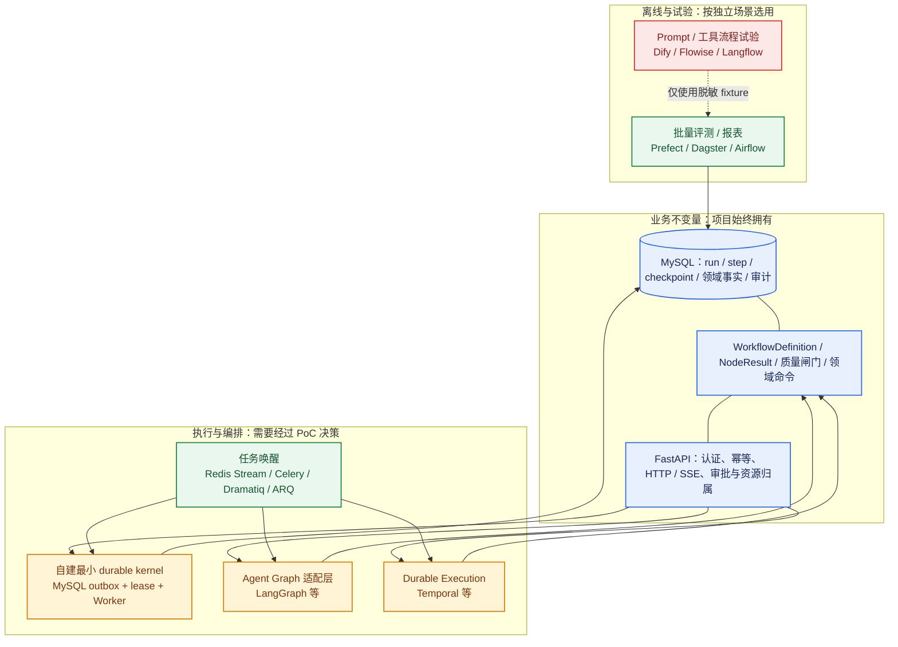

# 408 学习 Agent 工作流技术选型与风险分析

> 版本：v1.0
> 日期：2026-07-21
> 状态：调研与 PoC 决策输入，尚未形成最终 ADR
> 关联设计：[Agent 工作流编排技术设计](./408-agent-workflow-orchestration-design.md)、[Agent 对话运行时技术设计](./408-agent-conversation-runtime-design.md)
> 上游产品契约：[408 学习 Agent 主体 PRD](../product/408-agent-main-prd.md)

## 1. 目的、结论状态与阅读方式

本文回答三个问题：业界常见的 Agent Workflow 方案分别解决什么问题；这类学习型 Agent 在生产中最容易失败在哪里；本项目应如何以数据而非偏好选择技术栈。

本文不是对 LangGraph、Temporal 或任何平台的预先承诺，也不替代[工作流编排技术设计](./408-agent-workflow-orchestration-design.md)中的业务图、质量闸门和节点契约。后者定义“系统必须做什么”；本文比较“由什么技术实现”，并规定作出最终决策前必须完成的 PoC、量化指标和 ADR。

当前的**带条件初步倾向**如下，最终结论以 PoC 数据和 ADR 为准：

1. 保留 MySQL 中的业务事实、领域命令、审计和用户资源归属，不把它们交给工作流框架的隐式状态。
2. 以“最小 durable kernel”与“LangGraph 图编排适配层”做同一纵向切片 PoC；二者都必须服从既有 `WorkflowDefinition`、`AgentLoopPolicy`、`NodeResult`、checkpoint、outbox 和领域命令契约。
3. Temporal 是长时间等待、定时器、跨服务编排或可靠性目标显著提高时的重点候选，不因其成熟而在 P0 自动引入新的运行集群。
4. Celery、Dramatiq、ARQ 一类只适合任务唤醒或执行载体；Prefect、Dagster、Airflow 适合离线评测和批量任务；Dify、Flowise、Langflow 一类适合试验流程。它们均不应成为用户学习事实和审批链路的唯一事实源。

## 2. 当前系统事实与不可谈判条件

当前后端是 FastAPI + SQLAlchemy async + MySQL 8 + Redis + Qdrant；已有的 `backend/app/modules/chat` 仍是同步 RAG 问答，没有已落地的 Agent Runtime、持久化工作流引擎或独立 Worker。`backend/requirements.txt` 目前只有旧版 `langchain`，没有 LangGraph、Temporal、Celery、Dramatiq、ARQ、Prefect、Dagster 或 Airflow。

这意味着“直接接入一个框架”不会自动补齐运行时、领域和安全能力。无论最终选择什么技术，以下约束都不可改变：

| 约束 | 具体要求 | 框架不得替代的职责 |
|------|----------|--------------------|
| 业务事实源 | MySQL 保存 `run`、`step`、`checkpoint`、学习事实、审批、审计事件和 artifact 引用。Redis 只作唤醒和加速。 | 不能将框架内存、队列确认状态或 checkpoint 存储当成唯一业务真相。 |
| 领域写入 | 练习、计划、学习证据、错因和资料生命周期由各领域模块拥有。 | Workflow 节点必须调用版本化领域命令，不能直接写领域 ORM 表。 |
| 副作用安全 | 所有写入使用稳定幂等键；外部调用未知结果时先查询或补偿，不盲重试。 | 不能以“任务会重试”为理由接受重复创建练习、任务或计划。 |
| 人工控制 | 澄清和审批是持久化对象，用户输入需检查归属、Schema、版本和过期时间。 | 不能由模型文本或框架信号直接批准长期写入。 |
| 用户隔离 | 认证会话确定 `user_id`；检索、artifact、SSE 和恢复均需服务端再次校验归属。 | 不能让 prompt、客户端参数或工具选择取代权限判断。 |
| 可恢复性 | Worker 崩溃、Redis 故障、SSE 断开、模型超时后可从已提交的节点恢复。 | 不能只依赖进程内状态、broker memory 或 SSE 流。 |
| 可评测性 | 每个 run 锁定工作流、Prompt、工具和数据版本，记录真实轨迹。 | 不能只保存最终文本或框架的调试日志。 |

### 2.1 当前目标设计与业界成熟做法的对照

当前目标并非从零开始定义工作流语义：它采用的是“**外层持久业务 Workflow + 内层有界 Agent Loop + 确定性闸门 + 领域命令 + 可恢复执行**”的分层方向。外层图拥有业务阶段、等待、审批和副作用；内层 Loop 只在被授权的低风险阶段，依据 observation 选择下一次白名单内的只读探索动作。这个方向与生产 Agent 常见的可靠性分层一致，且比纯 Workflow 或自由工具循环都更适合学习事实、题目和计划等高约束场景。

| 维度 | 当前目标设计 | 与主流实践的关系 | 当前缺口或验证项 |
|------|--------------|------------------|------------------|
| 行为模型 | 外层为代码注册、版本锁定的持久图；指定 `agent_loop` 节点内允许有限回合的探索。 | 对应生产中的 durable workflow 包裹 constrained agent loop，而非“纯图”或“自由 Agent”。 | 图验证器、Loop policy、定义摘要和所有首发节点尚未落地。 |
| 模型职责 | 在节点中生成受 Schema 限制的路由、教学、排序和 Loop 决策提议。 | 符合“LLM 负责不确定语言决策，代码负责权限、预算和状态”的分工。 | 需要 fixture 证明模型输出无法越过候选集合、工具、预算和权限。 |
| 副作用 | 通过领域命令和派生幂等键写入学习域。 | 符合 saga / outbox / at-least-once 执行下的通用控制方式。 | `learning`、`practice` 等领域模块和命令结果查询尚未实现。 |
| 恢复 | 计划使用 MySQL run/step/checkpoint/event、租约和 outbox。 | 与 durable execution 的核心要求一致；框架可补执行能力。 | 需要在真实崩溃、发布和并发提交下验证局部恢复。 |
| 用户等待 | 用结构化 input/approval 和显式状态恢复。 | 符合 human-in-the-loop 不能占用 Worker 的主流方式。 | 需要验证多设备竞争、过期、取消和资源删除。 |
| 观测与发布 | 记录轨迹、质量闸门、版本、shadow/canary。 | 比只评最终回答更接近生产 Agent 的评测实践。 | 评测存储、故障注入和发布门禁尚未实现。 |

**判断：**当前设计在职责划分上合理，尤其是没有把“模型会调用工具”误当成工作流可靠性；但它尚未通过运行时和故障恢复验证。因此现在应比较的是执行层的实现成本与恢复质量，而不是推翻已定义的业务边界，也不应把某个框架的 demo 当作完整架构。

## 3. 技术版图：先按层分工，再比较产品

“Workflow”在行业里至少包含五层。把它们混成一个框架选型，会造成能力重复、事实分裂或过度建设。



图中的箭头不是部署拓扑承诺，而是职责关系：框架可驱动节点执行或提供 durable execution，但不能成为领域事实、权限或审批判断的主人。低代码平台的虚线表示其可用于隔离实验，不可反向成为生产学习记录的写入源。

### 3.1 主流行为编排模式：不是替代进化，而是分层组合

`Workflow`、`Loop` 和 `ReAct` 不是“旧方式被新方式替代”的线性世代关系，而是处在不同抽象层：**Workflow 管业务生命周期；Loop 管一个阶段内如何根据新 observation 继续探索；ReAct 是 Loop 常用的“思考（结构化决策）-> 动作 -> 观察”协议。**一个 Loop 当然可以规定步骤、出口和最大回合；它不能单独承担用户等待、审批、领域事实、跨服务恢复和高风险写入的业务语义。

因此，行业中成熟的形态通常不是“纯 Workflow”或“一个完全自由的 ReAct Agent”，而是外层工作流把模型限定在一个可审计的行动空间中。模型可以决定“下一次检索什么、是否检查某候选、何时已足够”，但不能决定“改走任意业务节点、无限重试、直接改计划”。

| 模式/层次 | 与其他模式的关系 | 优点 | 主要问题 | 本项目的使用边界 |
|-----------|------------------|------|----------|------------------|
| 外层确定性状态机 / Durable Workflow | 业务骨架；可包含 `agent_loop` 节点。 | 可审计、易测、适合等待、审批和副作用。 | 单独使用时，对开放式意图和探索策略较僵硬。 | 负责 `conversation`、练习、批改、计划、资料删除等的业务阶段、状态和所有写入边界。 |
| 有界 Agent Loop | Workflow 中的一个节点类型或受限子图；可有固定入口、动作白名单、退出结果和最大回合。 | 能针对证据、候选题、查询改写等不确定信息自适应探索。 | 若没有 policy、checkpoint 和出口，会退化为自由循环。 | `explain` 的证据探索、`validate` 的候选题发现等只读阶段。 |
| ReAct 决策协议 | 实现 Agent Loop 的一种协议，不等于完整业务 Workflow。 | “决策 -> 工具动作 -> observation”贴合工具探索，原型和诊断直观。 | 自由文本 thought、任意工具和无终止条件会带来成本、安全和复现问题。 | Loop 决策使用结构化 Schema 记录 action、args 和 expected outcome；不保存隐藏推理链。 |
| Planner-Executor | 可作为 Workflow 中的提议阶段，或作为 Loop 的一类决策策略。 | 适合展示任务拆解和长任务草稿。 | 计划会过期；执行器若可自由扩张，问题回到无界 Loop。 | 计划只作为 `proposal` 或用户可见草稿；真正执行仍回到外层图和领域命令。 |
| 多 Agent 协作 | 多个 Loop/角色之间的消息协议，不是单个 Loop 的必然下一步。 | 任务高度异质且每个角色可独立评测时可分工。 | 增加上下文传递、冲突、成本和调试难度，常被误用为复杂化。 | P0 不引入；先用单图中的明确节点、Loop policy 和闸门达成职责拆分。 |

**本项目的结论。**学习 Agent 的效果不等于自主程度。讲解效果主要受证据探索、证据门槛和教学组织影响，练习效果受题目发现、资格闸门和答案隔离影响，批改和长期计划则受快照、rubric、学习事实和审批影响。故采用混合模式：用 Loop 增加低风险探索的适应性，用 Workflow 保持关键事实和业务行为确定。

### 3.2 主流类别与适用边界

| 类别 | 代表方案 | 解决的核心问题 | 适合本项目的场景 | 不应直接承担的职责 |
|------|----------|----------------|------------------|--------------------|
| Agent Graph | [LangGraph](https://docs.langchain.com/oss/python/langgraph/overview) | LLM 条件分支、图状态、持久化、人工介入和图级调试。 | `conversation`、`explain`、`validate` 等有受限回边的模型/工具编排。 | 领域事实唯一来源、权限、审计和直接领域写入。 |
| Durable Execution | [Temporal](https://docs.temporal.io/workflows) | 可靠重试、长运行、timer、signal、跨进程恢复和工作流版本演进。 | 审批等待、跨服务任务、长期计划或定时复习编排显著扩大后。 | P0 的全部业务建模；它仍不能替代领域事务与资源校验。 |
| 队列加自建状态机 | MySQL outbox + Redis + Worker | 与现有事务紧耦合、部署简单、图数量有限时的可控恢复。 | P0 的首发五张图，尤其是练习快照、审批和审计强约束路径。 | 无上限增长后的复杂 timer、跨服务 saga 或可视化运维平台。 |
| 任务执行库 | [Celery](https://docs.celeryq.dev/)、[Dramatiq](https://dramatiq.io/)、[ARQ](https://arq-docs.helpmanual.io/) | 投递、并发、重试、Worker 生命周期和任务消费。 | outbox 的低延迟唤醒、无状态短任务或非核心派生工作。 | `run` 状态机、人工等待、领域副作用幂等和业务审计。 |
| 数据/批处理编排 | [Prefect](https://docs.prefect.io/v3/concepts/flows)、[Dagster](https://docs.dagster.io/guides/build/jobs)、[Airflow](https://airflow.apache.org/docs/apache-airflow/stable/core-concepts/dags.html) | 定时、批量、资产或数据管道的调度、观察和重跑。 | 离线评测、回归任务、内容批处理、报表和数据回填。 | 面向单用户的低延迟对话、澄清、审批和逐节点实时状态。 |
| 低代码 Agent 平台 | Dify、Flowise、Langflow 等 | Prompt、工具连接和流程原型的快速试验。 | 用脱敏 fixture 验证 Prompt 结构或工具组合。 | 核心用户数据、题目快照、学习事实、IDOR 防护、审批和审计链路。 |
| Agent SDK（轻量级运行时） | [OpenAI Agents SDK](https://github.com/openai/openai-agents-python) 等 | Agent 定义、工具注册、handoff、trace、guardrails；提供受约束的决策-动作-观察循环实现。 | 快速验证模型决策逻辑；作为内层 Loop 决策协议的轻量实现；多 Agent 原型。 | 持久化业务状态机、审批链、跨进程恢复、领域命令、版本锁定和 SSE 回放。 |
 | TypeScript Agent SDK（如 Pi） | [Pi（`pi-agent-core`）](https://pi.dev) | 终端编码场景的事件流驱动 Agent 运行时；支持 steering、follow-up、工具并行/顺序执行和细粒度事件流。 | 终端编码助手、CLI 工具或 IDE 插件中的交互式 Agent Loop；可作为 Loop 决策协议的参考实现。 | 持久化业务状态机、审批链、跨进程恢复、领域命令、版本锁定和 SSE 回放；且语言栈与 Python 后端不匹配。 |
 | Pydantic AI（类型安全 Agent 框架） | [pydantic-ai](https://github.com/pydantic/pydantic-ai) | 类型安全的 Agent/Tool/Graph 定义，多模型提供商支持，依赖注入，结果类型校验。 | 跨提供商的 Loop 决策协议验证；类型安全的工具注册和结果解析；Graph 编排原型。 | 持久化、审批、业务状态机、跨进程恢复；其 Graph 模式仍缺少 durable execution 和版本锁定。 |

### 3.3 不要把“框架能力”误读为“业务保证”

LangGraph 的官方资料覆盖图式 Agent、持久化、checkpoint、长期状态和人工介入；Temporal 的官方资料强调 durable Workflow、确定性约束、可靠执行和版本化。这些能力非常有价值，但都只能解决执行层的一部分问题。

例如，框架可以在进程中断后恢复某个节点，却无法判断“这个用户是否仍有权访问该资料”“计划草稿是否已被另一设备修改”“练习创建是否已经由同一幂等键成功提交”。这些判断必须回到本项目的领域表、版本号和命令结果。因此本项目采用“框架可替换、业务契约不可替换”的边界。

## 4. 评价标准与初始评分矩阵

评分用于缩小 PoC 范围，不是最终采购结论。分数为当前设计下的工程假设：`5` 表示天然适配，`3` 表示可实现但需明显补充，`1` 表示不适合承担该职责。最终评分必须由第 8 节 PoC 的实际数据替换。

| 维度 | 权重 | 评价问题 |
|------|------|----------|
| 领域一致性与副作用控制 | 20% | 能否清楚地与 MySQL 事务、outbox、领域命令和幂等键集成？ |
| 长运行、等待与恢复 | 15% | Worker 崩溃、用户等待、定时器、跨进程接管是否可靠？ |
| Agent 图表达力 | 15% | 受限条件分支、模型/工具节点、有限回边和 HITL 是否自然？ |
| 可观测性与回放 | 15% | 能否锁定版本、观察轨迹、重放 fixture 并定位单节点失败？ |
| Python/FastAPI 适配与交付速度 | 10% | 是否能与现有 async 栈和部署方式协作，团队是否容易调试？ |
| 运维成本与故障域 | 10% | 是否新增集群、broker、存储和升级负担，故障是否易演练？ |
| 锁定与迁移成本 | 10% | 是否可将业务图、状态和领域命令保留在项目内并替换执行层？ |
| 总计 | 100% | P0 先重视正确性、恢复和可观测性，不用“最快接入”覆盖这些维度。 |

| 方案 | 领域一致性 | 长运行恢复 | 图表达 | 观测回放 | FastAPI 适配 | 运维 | 迁移 | 初始加权判断 | 说明 |
|------|--------------|------------|--------|----------|--------------|------|------|--------------|------|
| 自建最小 durable kernel | 5 | 3 | 3 | 4 | 5 | 4 | 5 | 高，需验证 | 最贴合现有 MySQL/Redis；复杂 timer、跨服务 orchestration 增长后风险上升。 |
| LangGraph 适配层 + durable kernel | 4 | 3 至 4 | 5 | 4 | 4 | 4 | 3 | 高，需验证 | 图与模型节点表达强；必须验证 checkpoint、版本和业务状态不会双写失控。 |
| Temporal + 业务适配层 | 4 | 5 | 3 至 4 | 5 | 3 | 2 至 3 | 3 | 中高，有触发条件 | 耐久执行强，但新增服务、确定性编码约束和团队运维学习成本较高。 |
| 队列库作为核心工作流 | 2 | 2 至 3 | 2 | 2 | 4 | 4 | 3 | 低 | 可承载任务，却不自然表达用户等待、图版本、业务 checkpoint 与 Saga。 |
| Prefect/Dagster/Airflow 作为在线对话引擎 | 2 | 3 | 2 | 4 | 2 | 2 | 2 | 低 | 长处是离线调度和可观测，不是互动 Agent 的每轮状态。 |
| 低代码平台承载主业务链路 | 1 至 2 | 2 | 4 | 2 至 3 | 3 | 3 | 1 | 低 | 原型快，但业务治理、审计和可测试的领域演进会受限。 |
| Agent SDK 承载生产 Workflow | 1 至 2 | 1 至 2 | 3 | 3 至 4 | 4 | 3 | 3 | 低 | 适合 Loop 原型和决策试验；缺乏持久化、审批、领域命令和跨进程恢复，不能承载生产学习闭环。 |
 | `pi-agent-core`（Pi）承载生产 Workflow | 1 | 1 至 2 | 3 | 3 至 4 | 1 | 3 | 3 | 低 | 与 Agent SDK 同层，但语言栈（TypeScript）与 Python/FastAPI 后端严重错位；终端事件流模型与 Web API + SSE 体系需要大量适配；不能承载生产学习闭环。 |
 | Pydantic AI 承载生产 Workflow | 1 至 2 | 1 至 2 | 3 至 4 | 3 至 4 | 4 | 3 | 3 | 低 | 比 Agent SDK 更通用（多提供商、类型安全），但仍无持久化、审批和跨进程恢复；Graph 模式可作为编排参考，不能替代 durable Workflow。 |

初始矩阵刻意没有给任何方案“直接通过”。自建内核和 LangGraph 进入 P0 PoC，不代表两者必然同时进入生产；Temporal 的最终优先级取决于需求触发器和本项目能否承担其运维边界。

## 5. 各实现路径的收益、代价与采用条件

### 5.1 路径 A：自建最小 durable kernel

**形态。** 用项目内的 `WorkflowDefinition`、`NodeResult`、显式状态机、MySQL `run/step/checkpoint/event/outbox`、Worker 租约和 Redis 唤醒实现“一次只推进一个节点”。

**收益。**

- 数据模型与学习域事务完全一致；恢复、审计、SSE 回放和领域幂等可在同一事实体系中验证。
- 不新增 workflow 集群；首发图数量有限，行为可以直接在代码评审和 fixture 中读懂。
- `WorkflowDefinition` 和 checkpoint 由项目控制，为后续迁移到图框架或 durable execution 引擎保留出口。

**代价和风险。**

- 必须自行正确实现租约、扫描、睡眠唤醒、退避、幂等、版本迁移、死信观察和故障演练。
- 当工作流扩展为大量 timer、跨多个服务、数日等待和复杂补偿时，自建实现的维护成本可能超过框架收益。

**适用条件。** P0 仅有五张受限图、长等待主要是用户输入/审批、核心副作用均在同一模块化单体内、团队愿意把 durable kernel 作为长期维护组件时。

### 5.2 路径 B：LangGraph 作为 Agent Graph 适配层

**形态。** 保留项目的 Run/Step/Checkpoint 事实和领域命令；用 LangGraph 表达受限节点图、条件边、模型节点和人工等待。适配层负责把框架状态映射到项目的 `WorkflowDefinition`、`NodeResult` 与持久化事件，而不是反向让框架状态成为领域真相。

**收益。**

- 对 LLM 条件分支、图结构、持久化 checkpoint 和 human-in-the-loop 的表达接近问题域，能降低模型图节点的样板代码。
- 社区围绕 Agent 图、工具调用和追踪的可复用经验较多，适合验证首发受限图的开发效率。

**代价和风险。**

- 需要明确“两个状态存储谁为主”。若 LangGraph checkpoint 与 `agent_checkpoints` 同时承载可恢复业务状态，极易产生版本和恢复分叉。
- 可能引入框架自身的版本、状态序列化和执行模型约束；旧版 `langchain` 依赖也需要独立升级评估，不能隐式替换线上依赖。
- 框架的自由图或工具能力不得放宽本文约束；模型仍不能选择任意节点、工具或副作用。

**采用前置条件。** PoC 必须证明一次已成功领域命令后发生模型失败，恢复不会重复写入；已发布图版本可以恢复旧 run；SSE、审计和轨迹断言能从项目数据完整重建。

### 5.3 路径 C：Temporal 作为 durable execution 引擎

**形态。** 将需要长时等待、可靠 timer、signal、跨服务重试和补偿的流程封装为 Temporal Workflow；用 Activity 调用项目的领域命令和模型/工具适配层，业务事实仍写入 MySQL。

**收益。**

- 在长运行、worker 崩溃恢复、定时器、信号和可观测工作流历史上成熟，特别适合未来审批、复习调度、资料处理和跨服务事务扩大后的需求。
- Workflow 代码、重试、超时、版本演进和运行历史有清晰的执行模型，可减少自建 durable infrastructure 的边角实现。

**代价和风险。**

- 需要部署、监控、升级 Temporal 服务与存储，并训练团队遵守 deterministic Workflow 约束；这不是安装一个 Python 包即可完成。
- 外部模型调用、随机数、当前时间、数据库读取等需要放在 Activity 或受控边界内，代码结构会与普通 FastAPI 服务不同。
- Temporal 的成功不等于领域命令成功；Activity 可能至少一次执行，仍须使用项目的幂等键、版本冲突检测和 outbox。

**采用触发器。** 满足任一条件时，应把 Temporal 从“对照方案”提升为正式评估候选：

1. P1/P2 出现大量超过 15 分钟的 timer、等待、定时复习或跨服务操作，且自建扫描与恢复逻辑反复引发故障。
2. 工作流需要跨多个可独立部署服务协调、补偿和可视化运维，单库 outbox 不再覆盖主要故障面。
3. 业务要求的恢复成功率、审计可追溯性或故障恢复时限，无法用现有 durable kernel 以可接受人力保障。
4. 团队明确接受新增基础设施、值班与演练成本，并完成服务可用性、备份和升级方案评审。

### 5.4 路径 D：Celery、Dramatiq、ARQ 等任务库

**定位。** 这些库是候选的 Worker 运行载体或 outbox 消费者，不是工作流事实模型。它们可以帮助处理任务投递、并发、短任务重试和 Worker 管理。

**优点。** 工程成熟度较高、接入速度快，适合投递没有复杂用户等待的短任务，例如 artifact 派生、索引刷新、通知和某些离线工作。

**限制。** broker 的确认、延迟任务、重试次数和任务结果不是学习域的业务状态。将“用户等待审批”“练习已经创建”“计划已应用”编码为任务状态，会导致可见状态、权限和重试结果失去可审计的事实源。

**决策规则。** 只有在项目自己的 outbox、run lease 和 step 幂等已完成后，才比较是否使用其中之一替代 Redis Stream 消费循环。选择依据是吞吐、可观测、失败重取和运维能力，不是其是否带有 `retry` API。

### 5.5 路径 E：Prefect、Dagster、Airflow 等数据编排

**定位。** 这些工具更适合“批量、定时、数据资产或分析任务”，不是用户在浏览器中等待一条对话结果的运行时。

**推荐使用位置。**

- 固定评测集批量运行、版本对比、回归报告和成本汇总。
- 语料离线处理、内容质量回填、数据清洗、历史学习证据聚合和管理报表。
- 不触碰真实用户写入的 shadow run 与可重复 offline fixture。

**不适合的原因。** 在线对话需频繁地处理用户归属、短事务、结构化澄清、SSE、资源删除和每节点可见状态；把它们交给批处理 DAG 会造成反馈慢、状态模型别扭和实时失败处理不足。

### 5.6 路径 F：Dify、Flowise、Langflow 等低代码平台

**定位。** 作为 Prompt、工具组合、RAG 参数和简单流程的试验工作台，而非核心产品后端。

**可接受使用方式。** 使用脱敏、合成或公开 fixture，验证“某个讲解 Prompt 的结构是否更易通过引用闸门”或“工具返回 Schema 是否足够”。试验结果需回填为项目内的版本化 Prompt、Schema、fixture 和评测，不直接发布平台中的图。

**不可接受使用方式。** 让平台直接连接生产 MySQL、持有用户资料权限、写练习/计划事实或替代审批审计。否则运行记录、数据删除、版本锁定、IDOR 防护和故障恢复会被分散到难以治理的系统中。

### 5.7 路径 G：Agent SDK（OpenAI Agents SDK 等）

**形态。** Agent SDK（以 OpenAI Agents SDK 为代表）提供轻量级的 Agent 定义、工具注册、handoff 和 trace 能力。它把“Agent = 角色 + 工具集 + 指令 + handoff 规则”封装成可直接调用的对象，内部通过 LLM 的 function calling 完成决策-动作-观察循环。

**收益。**

- 极快原型速度。定义一个带工具的 Agent 只需几行代码，适合验证 Prompt 结构、工具返回 Schema 和决策逻辑。
- 内置 tracing 和 guardrails，对调试模型决策和观察 handoff 路径有帮助。
- handoff 机制在概念上接近“多 Agent 协作”，可作为未来多角色场景的快速试验。

**代价和风险。**

- **没有持久化。** Agent SDK 的 handoff 和状态在内存中进行，Worker 崩溃后无法恢复。它不提供 `run`、`step`、`checkpoint` 或版本锁定的语义。
- **不是 Workflow 引擎。** 它不解决业务状态机、审批、等待、副作用幂等、跨进程恢复和 SSE 回放问题。这些必须回到外层自建或 Temporal。
- **强绑定模型提供商。** OpenAI Agents SDK 深度绑定 OpenAI API 的 function calling 格式；虽然底层是 HTTP，但切换模型提供商时需要适配层。
- **handoff 不是业务转移。** SDK 中的 handoff 是运行时内存中的函数调用，不是持久化的业务阶段转移；它不能替代外层 Workflow 中“用户审批后才能进入计划节点”这样的确定性约束。

**适用条件。**

- 作为 PoC 工具：快速验证 Loop 内的决策逻辑、工具组合和 Prompt 效果。
- 作为 Loop 决策协议的参考实现：可以借鉴其 Agent 定义、工具注册和 trace 机制，但需自行实现持久化、policy gate 和 checkpoint。
- **不单独承载生产 Workflow。** 生产中的外层业务图、审批链、版本锁定和恢复仍必须回到自建 kernel 或 Temporal；Agent SDK 只能作为“Loop 内的决策实现细节”被封装，不能反过来定义业务边界。

**本项目判断。** Agent SDK 属于“快速原型和决策试验”层，与低代码平台类似。它可以加速 PoC 阶段对模型决策逻辑的验证，但不能替代 Workflow 引擎。若后续 PoC 中需要快速对比不同决策策略的效果，可以引入 Agent SDK 作为 fixture 试验工具；最终生产中的 Loop 决策仍需回到项目的 `AgentLoopPolicy`、`NodeResult` 和 checkpoint 体系。


 **补充：TypeScript Agent SDK 示例（Pi / `pi-agent-core`）**

 `pi-agent-core` 是 [Pi（pi.dev）](https://pi.dev) 项目的核心运行时模块，社区知名度高（~75k stars），生态完整（`pi-ai` 多提供商 LLM 层、`pi-tui` 终端 UI、`pi-coding-agent` CLI）。

 **与 Python Agent SDK 的差异。**
 - **语言栈：** TypeScript，与项目 Python/FastAPI 后端不匹配。跨语言引入会增加进程/服务边界、序列化开销和调试复杂度。
 - **设计场景：** 面向终端编码助手（CLI/IDE 插件），事件流模型为 `message_update`、`tool_execution_update` 等细粒度终端 UI 事件。这些假设与 Web API + SSE 回放体系需要大量适配。
 - **人机协作：** 内置 `steering` / `followUp`（终端内打断/续作），概念上有价值，但需自行映射到项目的 MySQL 审批/input/版本体系。
 - **生态优势：** `pi-ai` 提供多提供商统一层，`pi-tui` 提供 differential rendering，供应链安全实践（pinning、shrinkwrap、审计）成熟。但这些优势在跨语言场景下难以直接复用。

 **本项目判断。** `pi-agent-core` 与 Agent SDK 处于同一 Loop 层，不具备 Workflow 引擎能力。额外劣势是语言栈错位：它不是 Python 生态的组成部分，不能和 FastAPI/SQLAlchemy/Pydantic 共享类型定义和事务边界。因此它不应成为本项目 Loop 层的候选。
 ### 5.8 路径 H：Pydantic AI（类型安全 Agent 框架）

**形态。** Pydantic AI 由 Pydantic 团队开发，核心是把 Agent、Tool、依赖注入和结果类型用 Pydantic Schema 做端到端校验。它支持多个模型提供商（OpenAI、Anthropic、Google 等），并提供了 Graph/Agent 编排模式。

**与 Agent SDK 的关键差异。**

- **多提供商：** 不绑定 OpenAI，切换模型时只需改配置而非重写调用逻辑。
- **类型安全：** 工具参数、Agent 结果、依赖注入都用 Pydantic 校验，错误在调用前暴露。
- **Graph 模式：** 提供比 Agent SDK 更明确的节点/边定义，但仍缺少 durable execution、持久化 checkpoint 和业务状态机。

**代价和风险。**

- **同样没有持久化。** 和 Agent SDK 一样，状态在内存中，Worker 崩溃后无法恢复。
- **Graph 不是 Workflow。** 它的 Graph 是运行时编排图，不是持久化业务状态机；不能替代审批、等待、版本锁定和跨进程恢复。
- **生态较新。** 相比 LangGraph 和 Temporal，生产案例和运维经验较少。

**适用条件。**

- 作为类型安全的 Loop 决策实现：用 Pydantic Schema 替代手写解析，降低工具参数和模型输出的格式风险。
- 作为多提供商适配层：在模型适配器中统一用 Pydantic AI 封装不同提供商的调用。
- **不单独承载生产 Workflow。** 外层业务图、审批和恢复仍必须回到自建 kernel 或 Temporal。

**本项目判断。** Pydantic AI 比 Agent SDK 更通用、类型更安全，但在"是否适合承载生产 Workflow"这个问题上和 Agent SDK 处于同一层：都是 Loop 决策协议的轻量实现，不是 Workflow 引擎。它可以作为模型适配层的一部分被项目采用（尤其用于结构化输出解析和多提供商切换），但不能替代 `WorkflowDefinition` 和 `AgentLoopPolicy`。


 **与 `pi-agent-core` 的选型对比。**
 两者同属 Loop 层、都不承载 Workflow，但 Pydantic AI 对本项目有显著优势：
 - **语言栈一致：** Python 与 FastAPI/SQLAlchemy 同栈，类型定义可复用，调试路径统一。
 - **设计场景匹配：** 面向通用后端服务，不是终端编码助手；事件模型更接近 Web API 的 async 生成器模式。
 - **类型安全与验证：** Pydantic Schema 和项目 ORM/API Schema 生态兼容；工具参数校验、结构化输出解析可共享同一套类型定义。
 - **多提供商：** 原生支持 OpenAI/Anthropic/Google 等，不绑定单一提供商。

 因此，若 Loop 层需要一个类型安全的 SDK，Pydantic AI 是更合理的选择；`pi-agent-core` 因语言栈错位而不适合。
 ## 6. 生产中高频失败点与针对性防线

下表将常见问题按“为什么会发生、对学习 Agent 的影响、必须落地的防线、谁来决策”拆开。技术团队不能只以最终回答“看起来不错”判定工作流可靠。

| 失败模式 | 为什么常发生 | 在本业务的后果 | 必须实现的防线 | 主要决策者 |
|----------|--------------|----------------|----------------|------------|
| 无界 ReAct / Agent loop | 模型把“不确定”解释为继续搜、继续调用工具，或被 observation 诱导扩大行动空间。 | token 成本失控、反复检索、用户久等且没有结果。 | 外层图固定业务阶段；Loop action/tool 白名单、结构化 decision Schema、每轮 checkpoint、最大回合/工具/时长、固定出口；预算耗尽强制退出到闸门或降级。 | 产品负责人确定体验降级；技术负责人确定上限。 |
| 模型直连数据库或高权限工具 | 为了快速实现工具调用，跳过领域服务和 policy gate。 | 越权资料、伪造学习记录、计划被无审批修改。 | ToolContext 最小化；模型只返回受 Schema 限制提议；领域命令与审批独立执行。 | 技术负责人和安全负责人。 |
| 模型输出混入业务事实 | 将摘要、置信度或错因候选直接存成“掌握度”。 | 学习进度失真，后续计划建立在错误事实之上。 | `facts/proposals/controls` 分区；模型输出先过闸门和用户确认。 | 产品与学习内容负责人。 |
| Redis、内存或 SSE 被当成事实源 | 原型阶段直接把队列/连接状态当 run 状态。 | 断线、重启或重放后任务丢失、状态错乱。 | MySQL run/step/checkpoint/event；SSE 仅按持久序列回放。 | 技术负责人。 |
| at-least-once 重试重复副作用 | Worker 在命令提交后崩溃，重试不知道结果。 | 重复练习、重复复习任务、计划重复插入。 | 服务端派生幂等键、命令结果查询、局部恢复、补偿而非盲重试。 | 技术负责人。 |
| 全图重跑修复局部错误 | 框架或实现缺少节点结果和检查点。 | 已成功的题目快照、artifact 或审批会被重复执行。 | 每节点短事务提交、step attempt、明确 resume node、失败只重跑必要节点。 | 技术负责人。 |
| 等待、取消和过期没有状态模型 | 将用户回复视为新消息，或 Worker 长时间占锁等待。 | 多设备冲突、过期审批被应用、资源删除后仍继续执行。 | `agent_inputs`/`agent_approvals`、版本检查、过期、协作式取消和租约释放。 | 产品定义规则，技术负责实现。 |
| 工作流或 Prompt 升级后无法恢复旧 run | 只保存“当前代码”，未锁定定义摘要和 Schema。 | 线上进行中的任务在发布后报错或跑进新逻辑。 | 锁定 key/version/digest/schema/prompt/tool；提供迁移函数或安全失败。 | 技术负责人和发布负责人。 |
| RAG 引用越权或 prompt injection | 将资料正文当指令，或只由模型判断引用是否合法。 | 私人资料泄露、错误工具调用、无来源结论。 | 服务端资源过滤、内容不可信分层、citation 候选集校验、Prompt 与资料分离。 | 安全负责人和内容负责人。 |
| 生成题自验证、答案泄露 | 同一模型或上下文既生成又审核，并把答案带入排序。 | 题目错误、用户练习被提前泄题。 | 独立规则/模型/样本验证，题面快照，候选排序不含答案，失败不凑数。 | 内容与产品负责人。 |
| 客观评分交给模型 | 追求自然语言灵活性而跳过固定答案规则。 | 同一答案多次得分不同，学习事实不可信。 | 客观题确定性判定；主观题仅受限反馈，rubric 缺失则降级。 | 内容负责人。 |
| 只评最终文本，不评轨迹 | 评测没有记录工具、闸门、重试和命令。 | 偶然好文案掩盖越权、重复写入或质量绕过。 | `expected_trace`、工具调用断言、闸门断言、故障恢复用例和 0 容忍项。 | 评测负责人。 |
| SSE 事件乱序或重放错误 | 直接从日志推送，没有持久 sequence。 | 客户端显示倒退、重复卡片或错误的“已完成”。 | 事务内递增 sequence、`Last-Event-ID` 回放、客户端幂等渲染。 | 技术负责人。 |
| 过度 DAG 化或过度 agentic 化 | 将每个小判断拆成远程编排，或把所有判断交给模型。 | 前者延迟和维护成本高，后者不可控且难以测试。 | 本地确定性判断留在节点；只将有真实状态边界的动作拆成节点；模型职责窄化。 | 架构负责人。 |

## 7. 必须由负责人明确决策的事项

以下事项不能从框架文档、模型能力或工程习惯中自动推导。没有明确答案时，应采用保守默认值并记录为阻塞条件。

| 决策 | 可选方向与取舍 | 建议在何时定稿 | 默认保守处理 |
|------|----------------|----------------|--------------|
| 恢复目标 | 允许恢复到节点级，还是必须在外部工具调用中也保证查询/补偿？恢复时间目标是多少？ | W0 前 | 节点级恢复；未知副作用不盲重试。 |
| 重复副作用容忍度 | 练习、复习、计划、通知是否允许重复？是否需要人工处置入口？ | 各领域命令上线前 | 学习事实和计划为零容忍。 |
| 框架与运维预算 | 是否接受新集群、数据存储、值班与演练成本？ | Temporal 或新 broker 引入前 | 不新增 durable execution 集群。 |
| AI 生成题开放边界 | 哪些题型、质量阈值、标签和人工抽检比例可接受？ | `validate` 上线前 | 仅作为非正式练习，验证失败则减少题量。 |
| 自动批改边界 | 客观题、填空题、主观题分别允许自动给出什么结论？ | `grade` 上线前 | 客观题确定性；主观题有限反馈且不伪装官方阅卷。 |
| 长期计划写入 | 草稿是否自动生成、哪些差异需审批、审批有效期和冲突规则？ | `plan` 上线前 | 仅生成草稿，长期写入必须审批。 |
| `model_inference` 可见性 | 是否展示辅助推断、如何标注、哪些高风险内容禁止使用？ | 讲解扩展前 | 不把推断包装为有来源事实。 |
| 数据保留与审计 | 原始模型 I/O、用户资料、轨迹、审批和删除副本保存多久，谁可访问？ | 真实用户数据接入前 | 最小化保存、受控引用、访问需审计。 |
| 体验预算 | 每类工作流可接受的 p95 时延、失败率、单 run 成本和降级文案？ | W1 前 | 明确上限，超限走安全降级。 |
| 发布门槛 | 哪些错误为 0 容忍，样本规模、shadow 时长和 canary 范围是多少？ | 首次版本发布前 | 越权、重复副作用、答案泄露、审批前写入为 0 容忍。 |
| 锁定接受度 | 是否接受某框架特有状态格式和运行模型，退出路径是什么？ | 选型 ADR 前 | 业务定义、领域命令和审计数据始终存于项目内。 |

## 8. PoC 方案、验收矩阵与最终 ADR

### 8.1 PoC 原则

不要用玩具“聊天循环”比较框架。所有候选实现必须跑同一组纵向切片，并使用相同的领域命令、MySQL schema、模型适配器、工具 fixture、事件协议和错误注入；否则比较的是功能范围而不是可靠性。

首轮对比对象：

1. **PoC-A：自建最小 durable kernel。** 显式 `WorkflowDefinition`、MySQL checkpoint/outbox/lease、Redis 唤醒和独立 Worker。
2. **PoC-B：LangGraph 图适配层。** 相同的 `WorkflowDefinition`、领域命令和 MySQL 审计；只替换图执行和图状态适配部分。
3. **PoC-C：Temporal 可行性对照。** 不必完成全量产品功能；验证信号、等待、timer、Activity 幂等、部署和调试成本。仅在 P0 需求或第 5.3 节触发器成立时扩大为完整 PoC。

队列库、离线编排和低代码平台不与 A/B 争夺在线主 Runtime；它们按第 5 节各自场景单独验证。

### 8.2 统一纵向切片

实现 `explain@v1` 和 `validate@v1` 的最小真实切片：

```text
已认证请求
  -> create run / event / outbox
  -> 意图或明确动作校验
  -> 在只读、有界 Agent Loop 中读取授权范围、检索/检查证据或候选
  -> 模型生成结构化讲解或候选排序
  -> citation / question quality gate
  -> render artifact 或 practice.create_draft 命令
  -> 持久 event -> SSE replay
  -> 中断后从 checkpoint 恢复
```

`validate@v1` 必须覆盖一个真实的幂等副作用，不能只做只读模型图。所有模型可由 fixture 替代，以便将执行可靠性和模型质量分开测量。

### 8.3 强制故障注入与验收用例

| 用例 | 通过标准 |
|------|----------|
| Worker 在模型调用中退出 | 租约过期后接管；历史 step 可见；不会伪造模型调用成功。 |
| Loop 在工具 observation 已落库后退出 | 从下一未提交的 Loop turn 恢复；不重复已审计的只读动作，也不丢失已取得的 observation。 |
| 工具已成功、模型随后超时 | 工具结果保留；恢复只重试模型或降级节点；不重复工具副作用。 |
| `practice.create_draft` 提交后进程退出 | 按派生幂等键查到既有结果；练习草稿只有一份。 |
| 用户输入等待与多设备提交 | 只有当前用户、pending、未过期、版本匹配的输入可恢复；第二次提交稳定失败或返回既有结果。 |
| 取消、资源删除与审批过期 | 不再推进后续节点；不应用过期审批；用户得到可解释状态。 |
| SSE 断线和重连 | 依 `Last-Event-ID` 仅补发缺失持久事件，客户端不产生重复 artifact。 |
| 工作流/Prompt/工具版本发布 | 旧 run 按原 digest 恢复或进入明确的定义不可用状态；新 run 才使用新版本。 |
| 引用越权和注入文本 | 服务端拒绝不可见资源；不可信资料不能改变工具、审批或节点选择。 |
| Loop policy 越权 | 模型尝试未登记 action、工具、参数范围、写入、等待或超过回合数时，policy gate 拒绝并记录；run 只能进入定义的安全出口。 |
| 预算耗尽和质量闸门拒绝 | 不继续循环；产生规定的部分完成、证据不足或结构化等待结果。 |
| 轨迹评测 | run 的节点序列、工具、闸门、预算和命令数全部可从项目事实表重建。 |
| Loop 轨迹评测 | 每一轮 action、工具、observation 摘要、出口和预算都可重建；不保存隐藏思维链，也不允许 observation 改写 policy。 |

### 8.4 量化记录模板

每个 PoC 至少在相同 fixture 和故障注入次数下记录以下数据：

| 指标 | 记录方法 | 决策意义 |
|------|----------|----------|
| 实现工时与变更文件数 | 从第一条可运行切片到通过验收的实际投入。 | 衡量短期交付复杂度，不以代码行数判断。 |
| 运行依赖与运维面 | 新增服务、存储、broker、监控、备份和升级步骤。 | 衡量长期拥有成本和故障域。 |
| 恢复成功率 | 强制中断后恢复到正确终态的次数/总次数。 | 验证 durable execution，而不是正常路径。 |
| 重复副作用数 | 相同 `run/step/input_hash` 下多出练习、计划或学习事实的数量。 | 核心指标，目标为零。 |
| 轨迹完整度 | 可重建的 step、gate、tool、event、version 字段占比。 | 决定后续评测和排障是否可信。 |
| Loop 恢复与越权率 | 故障注入后的正确续跑次数，以及 policy 拒绝/尝试次数。 | 验证引入 Loop 后没有损失耐久性和工具边界。 |
| 定位耗时 | 注入故障后，工程师定位到失败节点和原因的时间。 | 衡量真实可运维性。 |
| p50/p95 时延与成本 | 按工作流和节点拆分。 | 检查框架开销是否损害交互体验。 |
| 版本恢复成功率 | 发布后恢复旧 run 的通过率。 | 防止框架状态迁移成为线上风险。 |

### 8.5 ADR 的最小内容与否决条件

PoC 结束后，技术负责人应提交一份 ADR，而不是只在会议中选择。ADR 至少包含：候选范围与排除理由、评分原始数据、架构边界图、部署与故障演练方案、状态所有权、数据迁移、升级策略、退出路径、成本估算、负责人和复审日期。

以下任一情况可直接否决候选实现：

- 无法证明领域命令在崩溃恢复后不重复执行。
- 无法在项目数据库中重建用户可见的 run 状态、审计事件和版本。
- 用户资料归属、审批、资源删除或 API/SSE 契约需要被框架行为绕过。
- 旧 run 在工作流或依赖升级后只能静默走新逻辑，不能恢复也没有明确失败状态。
- 评测只得到最终文本，无法断言实际工具、闸门和副作用轨迹。

## 9. 推荐的分层落地顺序

在 ADR 前，可以开始不会锁死选型的工作；这些工作对所有候选方案都必需。

1. **先固化框架无关契约。** 实现 `WorkflowDefinition`、`AgentLoopPolicy`、`LoopDecision`、`NodeResult`、状态 Schema、定义摘要、质量闸门、领域命令接口和 fixture；不在节点业务代码中直接引用某框架对象。
2. **完成 Runtime 事实链。** 建立 `run/step/checkpoint/event/outbox`、幂等、租约、SSE 回放和取消/过期；这些是任何执行引擎的外部可观察合同。
3. **以 A/B 运行同一首发切片。** 先用 fixture 模型与工具验证恢复，再接入真实检索和受限模型节点；每次只替换一个变量。
4. **按触发器评估 Temporal。** 当 timer、跨服务、等待时长或 SLO 已超过自建 kernel 的合理边界，再投入完整 PoC，而不是因未来假设过早建设集群。
5. **将离线能力独立建设。** 评测、报表和数据处理使用适合批处理的编排工具，不侵入在线用户 run；低代码平台的实验结果回写为代码、fixture 和版本记录。

最终在线架构可以是“项目拥有业务状态和领域命令 + 外层 durable Workflow + 内层受限 Agent Loop + 一个可替换的图执行适配层 + 一个可替换的任务唤醒层”。这不是重复造轮子：项目实现的是无法外包的学习域可靠性与 Loop policy；第三方框架只在确实降低执行或运维复杂度的层承担职责。

## 10. 参考资料

- [LangGraph Overview](https://docs.langchain.com/oss/python/langgraph/overview)：Agent 图、持久化和人工介入的官方概览。
- [LangGraph Persistence](https://docs.langchain.com/oss/python/langgraph/persistence)：checkpoint 和持久化状态的官方说明。
- [Temporal Workflows](https://docs.temporal.io/workflows)：durable Workflow、确定性约束、恢复和版本演进的官方说明。
- [Celery Documentation](https://docs.celeryq.dev/)：[任务队列](https://docs.celeryq.dev/en/stable/getting-started/introduction.html)的官方文档。
- [Dramatiq Documentation](https://dramatiq.io/) 与 [ARQ Documentation](https://arq-docs.helpmanual.io/)：Python 后台任务候选实现。
- [Prefect Flows](https://docs.prefect.io/v3/concepts/flows)、[Dagster Jobs](https://docs.dagster.io/guides/build/jobs)、[Airflow DAGs](https://airflow.apache.org/docs/apache-airflow/stable/core-concepts/dags.html)：离线与批处理编排的官方资料。
- [Building effective agents](https://www.anthropic.com/engineering/building-effective-agents)：区分 workflows 与 agents、从简单可组合工作流开始的公开工程经验。
